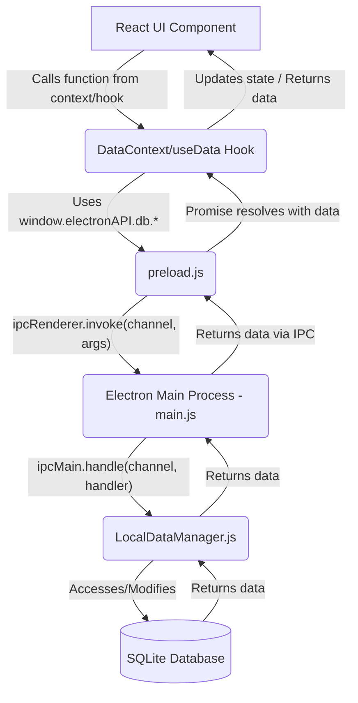
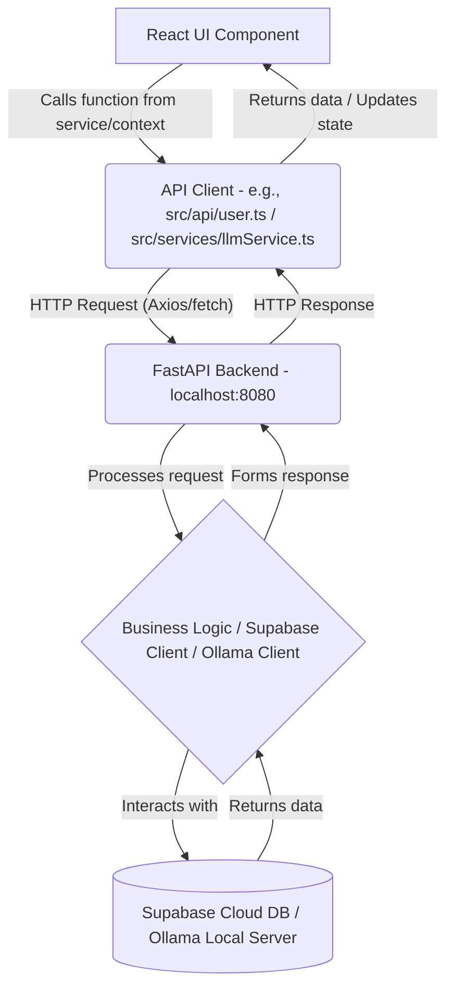

# 🚁 Wingman - Personal Assistant Dashboard

> A modern personal assistant desktop application that combines task management, calendar events, diary entries, and an AI chatbot in one unified interface.


<p align="center">
  
  
  
  
  
  
</p>


````markdown
# 🚁 **WINGMAN PROJECT ARCHITECTURE - COMPREHENSIVE ANALYSIS REPORT**

## NEW FEATURES

1. **🎨 ADVANCED THEME SYSTEM** - 6 complete themes (Dark, Light, Yandere, Kuudere, Tsundere, Dandere)
2. **🤖 OLLAMA AI INTEGRATION** - Ready for local LLM deployment
3. **🔐 HYBRID AUTH ARCHITECTURE** - Supabase + Local SQLite dual-layer
4. **📱 MODEL MANAGER** - AI model download/management system
5. **🎯 NOTIFICATION SYSTEM** - Mission-style notifications with task completion celebrations
6. **🏗️ ELECTRON PACKAGING** - Complete build system with Python bundling

---

## 📋 **TABLE OF CONTENTS**

1. **SYSTEM OVERVIEW & ARCHITECTURE PATTERNS**
2. **DATA FLOW ARCHITECTURE**
3. **AUTHENTICATION & USER MANAGEMENT FLOW**
4. **CRUD OPERATIONS FLOW ANALYSIS**
5. **CHAT & AI INTEGRATION FLOW**
6. **ELECTRON PROCESS ARCHITECTURE**
7. **FRONTEND-BACKEND COMMUNICATION PATTERNS**
8. **DATABASE DUAL-LAYER STRATEGY**
9. **FILE STRUCTURE & DEPENDENCY MAPPING**
10. **DEVELOPMENT VS PRODUCTION ARCHITECTURE**
11. **OLLAMA INTEGRATION READINESS ASSESSMENT**
12. **MULTI-INSTANCE PROTECTION & RESOURCE MANAGEMENT**

---

## 1. 📊 **SYSTEM OVERVIEW & ARCHITECTURE PATTERNS**

### **1.0 NEW: Task Completion Notification Flow**

We've implemented a robust notification system to congratulate users when they complete tasks. This creates a more rewarding experience and reinforces positive behavior patterns. Here's how it works:

```typescript
// MULTI-POINT NOTIFICATION ARCHITECTURE
// The system ensures notifications fire reliably by implementing them at multiple UI entry points:

// 1. Direct UI interactions (TasksCard.tsx)
// When a user clicks the complete task button in TasksCard:
try {
  const { systemNotificationService } = await import(
    "../../services/SystemNotificationService"
  );
  await systemNotificationService.showTaskCompletion(task.title);
  console.log(
    `WINGMAN SUCCESS: Congratulation notification sent for task: ${task.title}`
  );
} catch (error) {
  console.error(
    "WINGMAN ERROR: Failed to send congratulation notification:",
    error
  );
}

// 2. Dashboard task completion (Dashboard/index.tsx)
// When tasks are toggled via the Dashboard:
if (!task.completed && updatedTask?.completed) {
  try {
    const { systemNotificationService } = await import(
      "../../services/SystemNotificationService"
    );
    await systemNotificationService.showTaskCompletion(
      updatedTask.title || task.title
    );
    console.log(
      `WINGMAN SUCCESS: Congratulation notification sent for task: ${
        updatedTask.title || task.title
      }`
    );
  } catch (error) {
    console.error(
      "WINGMAN ERROR: Failed to send congratulation notification:",
      error
    );
  }
}

// 3. Data Context layer (DataContext.tsx)
// Already includes notifications through these methods:
// - updateTask() - Existing notification when task status changes to completed
// - toggleTask() - Existing notification when task is completed via toggling

// Components like DayView.tsx and Notifications.tsx use these DataContext methods,
// so they automatically trigger notifications without additional code.
```

This multi-layered approach ensures that users receive congratulation notifications regardless of how they complete a task, while avoiding duplicate notifications by removing redundant event dispatches. The notification system provides immediate positive feedback to users, reinforcing their productivity habits.

### **1.1 Current Tech Stack (2025)**

- **Frontend:** React, TypeScript, Vite, Electron
- **UI Styling:** CSS Modules, Custom CSS Properties for Theming
- **State Management:** React Context API (AuthContext, DataContext, ThemeContext, etc.)
- **Backend:** Python, FastAPI, Uvicorn
- **Local Database:** SQLite (via `better-sqlite3` in Electron main process)
- **Cloud Services:** Supabase (PostgreSQL) for Authentication & User Profiles
- **AI/LLM:** Ollama (local integration)
- **HTTP Client:** Axios (Frontend), HTTPX (Backend)
- **Desktop Wrapper:** Electron

### **1.2 NEW: Theme Architecture**

```typescript
// src/context/ThemeContext.tsx - COMPLETE THEME SYSTEM
type Theme = "dark" | "light" | "yandere" | "kuudere" | "tsundere" | "dandere";
// Each theme includes:
// - CSS variables for colors/effects (defined in main.css and component-specific CSS)
// - Background videos (.mp4) (e.g., src/assets/backgrounds/videos/dark-theme.mp4)
// - Background images (.png) (e.g., src/assets/backgrounds/dark-theme.png)
// - Theme-specific animations (CSS animations)
// - Login screen integration (Login.tsx dynamically loads theme videos)
```
````

### **1.3 NEW: AI Integration Architecture**

```plaintext
# Wingman-backend/app/services/llm/ - OLLAMA READY
- ollama_service.py (Ollama API integration)
- context_builder.py (SQLite data context for LLM)
- prompts.py (System prompts, personality-driven)
- humor.py (Personality system integration for LLM responses)

# Frontend Integration (src/services/llmService.ts)
- Communicates with FastAPI backend for LLM operations.
- Manages model selection and interaction via ModelManager.tsx.
```

### **1.4 High-Level Architecture Pattern**

```
┌─────────────────┐    ┌──────────────────┐    ┌─────────────────┐
│   ELECTRON      │    │    FASTAPI       │    │   SUPABASE      │
│   MAIN PROCESS  │◄──►│    BACKEND       │◄──►│   POSTGRES      │
│   (Node.js)     │    │    (Python)      │    │   (Cloud)       │
│ ┌─────────────┐ │    │ ┌──────────────┐ │    │ ┌─────────────┐ │
│ │   SQLITE    │ │    │ │   HTTP API   │ │    │ │   AUTH      │ │
│ │ (Local DB)  │ │    │ │  (localhost) │ │    │ │ USER PROFILES││
│ └─────────────┘ │    │ └──────────────┘ │    │ └─────────────┘ │
└─────────────────┘    └──────────────────┘    └─────────────────┘
         ▲                        ▲                        ▲
         │ (IPC)                  │ (HTTP)                 │ (HTTPS)
┌─────────────────┐    ┌──────────────────┐    ┌─────────────────┐
│   REACT UI      │    │   VITE DEV       │    │   NETWORK       │
│  (Renderer Proc)│    │   SERVER (:5173) │    │   LAYER         │
│  (Browser Env)  │    │   (Development)  │    │   (Axios/HTTPX) │
└─────────────────┘    └──────────────────┘    └─────────────────┘
```

### **1.5 Architectural Patterns Identified**

**🏗️ HYBRID DATA ARCHITECTURE:**

- **Local-First**: SQLite for core application data (tasks, events, diary, chat history), ensuring offline functionality and immediate responsiveness. Managed by `LocalDataManager` in Electron's main process.
- **Cloud-Sync**: Supabase for user authentication, user profiles, and settings. This allows for account recovery and potential cross-device synchronization of profile data in the future.
- **Data Separation**: Clear distinction between what's local (sensitive personal data, operational data) and what's cloud-managed (identity, high-level settings).

**🔄 EVENT-DRIVEN COMMUNICATION:**

- **IPC (Inter-Process Communication)**: Electron main process ↔ renderer process communication via `contextBridge` (preload.js) and `ipcRenderer`/`ipcMain`. Used for all SQLite database operations and system-level calls (e.g., DevTools toggle).
- **HTTP/HTTPS**:
  - Frontend (React) ↔ FastAPI Backend: For operations requiring backend logic, AI interaction, or Supabase proxying (e.g., registration). Uses Axios.
  - FastAPI Backend ↔ Supabase: For authentication and user profile management. Uses HTTPX and Supabase Python client.
- **Custom DOM Events**: Used for intra-renderer communication or global state notifications (e.g., `dashboard-refresh`, `sidebar-visibility-change`, `avatar-updated`).

**⚡ PERFORMANCE PATTERNS:**

- **Optimistic UI**: UI updates immediately on user actions (e.g., task completion), with background operations handling persistence.
- **Virtualization**: Used in lists (e.g., `VirtualizedList.tsx`) to efficiently render large datasets.
- **Memoization**: React.memo, `useMemo`, `useCallback` used extensively to prevent unnecessary re-renders.
- **Code Splitting/Lazy Loading**: Implicitly handled by Vite for production builds.
- **Process Isolation**: Python backend runs as a separate process, spawned and managed by Electron's main process, preventing backend crashes from affecting the UI.
- **GPU Acceleration**: Electron configured with flags for improved rendering performance.

### **1.6 User Data Separation Strategy**

**🔐 SUPABASE HANDLES (via FastAPI Backend):**

- User authentication (login/register) - `Wingman-backend/app/api/v1/endpoints/user.py`
- User profiles & settings (planned for cloud sync, currently local or via Supabase direct for auth data)
- Account management (password changes, etc. - via Supabase)
- Session management (JWT tokens issued by FastAPI after Supabase auth)

**💾 SQLITE HANDLES (via Electron Main Process - `LocalDataManager`):**

- User's personal data (tasks, events, diary) - `tasks`, `calendar_events`, `diary_entries` tables
- Chat history - `chat_messages`, `chat_sessions` tables
- App preferences (e.g., selected AI model, theme - potentially in `user_settings` table or `localStorage`)
- Downloaded AI Models metadata - `downloaded_models` table
- Offline functionality for all core features.

---

## 2. 🔄 **DATA FLOW ARCHITECTURE**

### **2.1 Primary Data Flow Patterns**

#### **Pattern A: SQLite-First Operations (Tasks, Calendar, Diary, Local Chat History)**

```
1. User Action (e.g., create task in DayView.tsx)
     │
     ▼
2. React Component (e.g., DayView.tsx calls `createTask` from `useData`)
     │
     ▼
3. DataContext.tsx (`createTask` function)
     │
     ▼
4. window.electronAPI.db.saveTask(taskData) (Call to preload.js exposed API)
     │
     ▼
5. IPC Message ('db:saveTask') sent from Renderer to Main Process
     │
     ▼
6. Electron Main Process (main.js - IPC Handler for 'db:saveTask')
     │
     ▼
7. LocalDataManager.js (`saveTask` method)
     │
     ▼
8. SQLite Database (better-sqlite3 execution)
     │
     ▼
9. Response/Saved Data returned to LocalDataManager
     │
     ▼
10. Response returned to Electron Main Process IPC Handler
     │
     ▼
11. IPC Message (response) sent from Main to Renderer Process
     │
     ▼
12. Promise resolves in DataContext.tsx (`await window.electronAPI.db.saveTask`)
     │
     ▼
13. React Component receives saved data, updates state (e.g., via `fetchDayData` or optimistic update)
     │
     ▼
14. UI Re-renders with new data
```

#### **Pattern B: Authentication Flow (Supabase via FastAPI Backend)**

```
1. User Enters Credentials (e.g., in Login.tsx)
     │
     ▼
2. React Component (Login.tsx calls `handleLogin` or `handleRegister`)
     │
     ▼
3. API Client (e.g., direct fetch or src/api/user.ts if abstracted)
     │  (HTTP POST to FastAPI: /api/v1/user/login or /api/v1/user/register)
     ▼
4. FastAPI Backend (Wingman-backend/app/api/v1/endpoints/user.py)
     │  (Receives request)
     ▼
5. Supabase Service (Wingman-backend/app/core/supabase.py or Supabase client direct call)
     │  (Interacts with Supabase Auth)
     ▼
6. Supabase Auth (Cloud - validates credentials / creates user)
     │
     ▼
7. Response (User data, session) returned to Supabase Service
     │
     ▼
8. FastAPI Backend (issues JWT token if successful)
     │
     ▼
9. HTTP Response (JWT, user data) sent to Frontend API Client
     │
     ▼
10. API Client receives response
     │
     ▼
11. Login.tsx / AuthContext.tsx (stores token in localStorage, user data in localStorage/state)
     │
     ▼
12. Global Auth State Update (AuthContext notifies subscribers)
     │
     ▼
13. App re-renders, navigates to authenticated routes
```

#### **Pattern C: AI Chat Flow (Ollama via FastAPI Backend)**

```
1. User Input in Chat UI (src/components/ChatBot/index.tsx)
     │
     ▼
2. ChatContext.tsx / llmService.ts (`sendMessage` function)
     │  (Optionally builds context from local SQLite via electronAPI)
     ▼
3. API Client (src/api/chat.ts or llmService.ts direct fetch)
     │  (HTTP POST to FastAPI: /api/v1/chat/stream or similar)
     ▼
4. FastAPI Backend (Wingman-backend/app/api/v1/endpoints/chat.py)
     │
     ▼
5. LLM Service (Wingman-backend/app/services/llm/ollama_service.py)
     │  (Constructs prompt using context_builder.py, prompts.py, humor.py)
     ▼
6. Ollama Client (Python `ollama` library)
     │  (Sends request to local Ollama server)
     ▼
7. Local Ollama Server (Responds with AI-generated text stream)
     │
     ▼
8. Ollama Client receives stream
     │
     ▼
9. LLM Service streams response back to FastAPI endpoint
     │
     ▼
10. FastAPI Backend streams HTTP Response to Frontend API Client
     │
     ▼
11. API Client / llmService.ts receives stream
     │
     ▼
12. ChatContext.tsx updates chat messages state incrementally
     │
     ▼
13. Chat UI (MessageBubble.tsx) renders streamed response
     │
     ▼
14. (Optional) Save full conversation to SQLite via Pattern A (electronAPI.db.saveChatMessage)
```

---

## 3. 🔐 **AUTHENTICATION & USER MANAGEMENT FLOW**

This section details the hybrid authentication architecture.

### **3.1 Registration Flow**

1.  **UI (`Login.tsx`)**: User enters email, password, username, name.
2.  **Validation**: Basic client-side validation (e.g., email format, password length).
3.  **API Call**: `fetch` POST request to `http://localhost:8080/api/v1/user/register` with user data.
    - Handled by `handleRegister` in `Login.tsx`.
4.  **Backend (`Wingman-backend/app/api/v1/endpoints/user.py`)**:
    - Receives registration request.
    - Validates data (Pydantic models).
    - Interacts with Supabase Auth (`supabase.auth.sign_up`).
    - If Supabase registration is successful, it may store additional profile info or rely on Supabase.
5.  **Response**: Backend returns user object (including Supabase ID) and potentially a JWT.
6.  **UI (`Login.tsx`)**:
    - Stores user data and token in `localStorage`.
    - Updates `AuthContext` via `onLogin` callback.
    - Navigates to `/profile` with `showSetup: true` state for onboarding.
    - Shows `WelcomePopup`.

### **3.2 Login Flow**

1.  **UI (`Login.tsx`)**: User enters email and password.
2.  **API Call**: `fetch` POST request to `http://localhost:8080/api/v1/user/login`.
    - Handled by `handleLogin` in `Login.tsx`.
3.  **Backend (`Wingman-backend/app/api/v1/endpoints/user.py`)**:
    - Receives login request.
    - Interacts with Supabase Auth (`supabase.auth.sign_in_with_password`).
4.  **Response**: Backend returns user object, Supabase session data, and a JWT.
5.  **UI (`Login.tsx`)**:
    - Stores user data and token in `localStorage`.
    - Updates `AuthContext` via `onLogin` callback.
    - App.tsx redirects to authenticated routes.

### **3.3 User Data Separation Strategy**

(Covered in Section 1.6)

### **3.4 State Management (`AuthContext.tsx`, `AuthStateManager.ts`)**

- `AuthContext.tsx`: Provides global authentication state (`isAuthenticated`, `user`).
- `AuthStateManager.ts`: A utility class to manage authentication state, listen for changes, and handle login/logout logic centrally.
  - `Auth.isAuthenticated`: Boolean flag.
  - `Auth.addListener()`: Allows components to subscribe to auth state changes.
  - `Auth.handleLogout()`: Clears `localStorage`, sets `isAuthenticated` to false.
  - `Auth.setAuthenticated()`: Sets auth state, stores user ID.
- `localStorage`: Persists `user` object and `token` across sessions.
- App.tsx: Initializes auth state from `localStorage` and listens for changes from `AuthStateManager`.

### **3.5 Protected Route Strategy**

- App.tsx conditionally renders `<Login>` component or the main application layout based on `isAuthenticated` state.
- Authenticated routes are wrapped within providers (`ThemeProvider`, `AvatarProvider`, `DataProvider`, etc.).

---

## 4. 📝 **CRUD OPERATIONS FLOW ANALYSIS**

All local CRUD operations are mediated by DataContext.tsx, which uses `window.electronAPI.db.*` calls exposed via preload.js to interact with `LocalDataManager.js` in the Electron main process.

### **4.1 SQLite CRUD Architecture**

#### **4.1.1 Task Operations Flow (Example: Create Task from DayView.tsx)**

1.  **DayView.tsx**:
    - User fills task form (`newTask` state).
    - `handleTaskSubmit` is called on form submission.
    - Calls `createTask(newTaskData)` from `useData()` (which is `useDataContext`).
2.  **DataContext.tsx (`createTask` method)**:
    - Sets loading state.
    - Gets `userId` using `getCurrentUserId()`.
    - Sanitizes `taskData` for SQLite compatibility.
    - Calls `await window.electronAPI.db.saveTask(sanitizedTask)`.
3.  **preload.js**:
    - `electronAPI.db.saveTask` maps to `ipcRenderer.invoke('db:saveTask', task)`.
4.  **main.js (Electron Main Process)**:
    - `ipcMain.handle('db:saveTask', async (event, task) => { return dataManager.saveTask(task); })`.
5.  **localDataBridge.js (`LocalDataManager.saveTask` method)**:
    - Performs final data sanitization.
    - Constructs SQL `INSERT` statement.
    - Executes statement using `this.db.prepare(...).run(...)`.
    - Returns the newly created task with its `id`.
6.  **Response Propagation**: The saved task object flows back through IPC to DataContext.tsx.
7.  **DayView.tsx**:
    - `createTask` promise resolves.
    - Calls `fetchDayData()` to refresh the task list, or optimistically updates the local state.
    - UI updates.

#### **4.1.2 Detailed CRUD Flow (Generic for Tasks, Events, Diary)**

- **Create**:
  - Component → `DataContext.create<Entity>` → `window.electronAPI.db.save<Entity>` → IPC → `LocalDataManager.save<Entity>` → SQLite `INSERT`.
- **Read**:
  - Component → `DataContext.fetchDayData` (or specific fetcher) → `window.electronAPI.db.get<Entities>` → IPC → `LocalDataManager.get<Entities>` → SQLite `SELECT`.
  - Example: DayView.tsx uses `fetchDayData` which calls `window.electronAPI.db.getTasks` and `getEvents`.
- **Update**:
  - Component → `DataContext.update<Entity>` → `window.electronAPI.db.update<Entity>` → IPC → `LocalDataManager.update<Entity>` → SQLite `UPDATE`.
  - Example: TasksCard.tsx calls `window.electronAPI.db.updateTask` directly for completion. DayView.tsx uses `updateTask` from `DataContext`.
- **Delete**:
  - Component → `DataContext.delete<Entity>` → `window.electronAPI.db.delete<Entity>` → IPC → `LocalDataManager.delete<Entity>` → SQLite `DELETE`.
  - Example: DayView.tsx uses `deleteTask` from `DataContext`.

### **4.2 Calendar Events CRUD Flow**

- Follows the generic CRUD flow described in 4.1.2.
- Key files: DayView.tsx, `EventModal.tsx`, DataContext.tsx (methods: `createEvent`, `updateEvent`, `deleteEvent`, `fetchDayData`).
- `LocalDataManager.js` methods: `getEvents`, `saveEvent`, `updateEvent`, `deleteEvent`.

### **4.3 Diary Entries CRUD Flow**

- Follows the generic CRUD flow described in 4.1.2.
- Key files: DiaryEntry.tsx, `ViewEntries.tsx`, `DiaryContext.tsx` (if used, or DataContext.tsx if centralized). `useDiary()` hook.
- `LocalDataManager.js` methods: `getDiaryEntries`, `saveDiaryEntry`, `deleteDiaryEntry`.

---

## 5. 💬 **CHAT & AI INTEGRATION FLOW**

(Covered in Data Flow Pattern C, Section 2.1)

### **5.1 Frontend Components & Context**

- **index.tsx**: Main UI for chat interaction.
- **`ChatBot/MessageBubble.tsx`**: Renders individual chat messages.
- **`ChatBot/QuickReplies.tsx`**: Displays suggested replies.
- **`ChatContext.tsx`**: Manages chat state (messages, loading, errors), provides functions to send messages.
- **`services/llmService.ts`**: Handles communication with the backend for LLM interactions. May use `api/chat.ts`.
- **`components/Profile/ModelManager.tsx`**: Allows users to view, download (metadata saved locally), and select AI models. Selected model preference might be saved in `user_settings` table or `localStorage`.

### **5.2 Backend Services (FastAPI)**

- **`Wingman-backend/app/api/v1/endpoints/chat.py`**: FastAPI router for chat-related requests.
- **`Wingman-backend/app/services/chat.py`**: Business logic for chat, orchestrates LLM calls.
- **`Wingman-backend/app/services/llm/`**:
  - `ollama_service.py`: Interacts with the Ollama Python client to send requests to a local Ollama instance.
  - `context_builder.py`: Gathers relevant context from SQLite (tasks, events, diary) to provide to the LLM. This likely involves an IPC call from backend to Electron main if backend needs direct SQLite access, or frontend sends context. _Correction: Backend typically doesn't directly IPC to Electron main. Frontend would fetch context via `electronAPI` and send it to backend._
  - `prompts.py`: Contains various system prompts and templates for different personalities/tasks.
  - `humor.py`: Implements the personality/humor logic for tailoring AI responses.

### **5.3 Local Data Integration**

- Chat history is saved locally in SQLite via `LocalDataManager.saveChatMessage` and retrieved by `LocalDataManager.getChatHistory`.
- Quick prompts are managed in SQLite via `LocalDataManager` (e.g., `getQuickPrompts`, `saveQuickPrompt`).

---

## 6. ⚡ **ELECTRON PROCESS ARCHITECTURE**

### **6.1 Process Structure & Communication**

- **Main Process (main.js)**:
  - Entry point of the Electron application.
  - Manages application lifecycle (windows, startup, quit).
  - Spawns and manages the FastAPI backend Python process.
  - Creates `BrowserWindow` (renderer process).
  - Handles all IPC calls from the renderer process for database access and system operations.
  - Initializes `LocalDataManager` for SQLite operations.
  - Registers global shortcuts (e.g., F12 for DevTools).
  - Handles backend health checks and restarts.
- **Renderer Process (React App loaded in `BrowserWindow`)**:
  - Runs the React frontend application (`src/`).
  - Isolated from Node.js APIs for security ( `nodeIntegration: false`, `contextIsolation: true`, `sandbox: true`).
  - Communicates with the Main process exclusively through APIs exposed by preload.js via `contextBridge`.
- **Preload Script (preload.js)**:
  - Acts as a bridge between the Renderer process and the Main process.
  - Selectively exposes specific IPC channels and functionalities (`window.electronAPI`) to the Renderer.
  - Does _not_ expose full Node.js or Electron APIs to the Renderer.
- **FastAPI Backend Process (Python)**:
  - Spawned as a child process by main.js.
  - Runs independently, listening on `http://localhost:8080`.
  - Communicates with the Frontend (Renderer process) via HTTP.

### **6.2 IPC Communication Architecture (preload.js & main.js)**

- **preload.js (`contextBridge.exposeInMainWorld('electronAPI', ...)`):**
  Exposes the following to the renderer:
  - `db.*`: Functions for all SQLite CRUD operations (e.g., `getTasks`, `saveTask`, `getEvents`, `saveDiaryEntry`, `getChatHistory`, `saveChatMessage`, `getQuickPrompts`, `saveDownloadedModel`, `getUserSettings`). Each function internally uses `ipcRenderer.invoke` to call a corresponding handler in the main process.
  - `system.*`: System utilities like `toggleDevTools`, `openExternal`, `getVersion`, `getPlatform`, `isDevMode`.
  - `files.*`: File system operations like `selectFile`, `saveFile`, `readFile`, `writeFile`.
  - `gpu.getInfo`: To get GPU information.
  - `notifications.*`: (As seen in SystemNotificationService.ts) For scheduling and showing system notifications via the main process.
- **main.js (`ipcMain.handle(channel, handler)` and `ipcMain.on(channel, handler)`):**
  - Defines handlers for each channel invoked/sent by preload.js.
  - Example: `ipcMain.handle('db:getTasks', async (event, userId, date) => dataManager.getTasks(userId, date));`
  - Database handlers typically call methods on the `LocalDataManager` instance.
  - System handlers perform Electron-specific actions (e.g., `BrowserWindow.getFocusedWindow().webContents.toggleDevTools()`).

### **6.3 Process Lifecycle Management (main.js)**

- **Backend Startup**:
  - `startBackendServer()` is called on `app.whenReady()`.
  - `findPythonExecutable()` attempts to locate a suitable Python interpreter (bundled, venv, system).
  - `forceReleasePort(8080)` ensures the backend port is free.
  - Python backend is spawned using `child_process.spawn`.
  - Output (stdout, stderr) from the backend is logged.
  - Health check (`http://localhost:8080/health`) confirms backend is running before loading the app URL.
- **Window Creation**:
  - `createWindow()` sets up the `BrowserWindow` with security-conscious `webPreferences`.
  - Loads `http://localhost:5173` in development (Vite dev server) or `file://${path.join(__dirname, '../dist/index.html')}` in production.
- **Shutdown**:
  - `app.on('will-quit')`: Unregisters global shortcuts.
  - `app.on('window-all-closed')`:
    - Closes `LocalDataManager` database connection.
    - Terminates the `backendProcess` if it's running.
    - Quits the app (except on macOS).

---

## 7. 🌐 **FRONTEND-BACKEND COMMUNICATION PATTERNS**

### **7.1 Communication Layer Architecture**

**Local Data Access (SQLite via Electron IPC):**



**Remote Operations (FastAPI Backend via HTTP):**



**Frontend UI to Local SQLite (Chat UI Example from Doc):**
This is a specific instance of the "Local Data Access" pattern.

```
┌─────────────────┐      ┌──────────────────┐      ┌─────────────────┐
│ Chat UI (Local) │───►  │ electronAPI (IPC)│───►  │ SQLite (Local)  │
│ (React Component) │      │ (preload.js ->   │      │ (via LocalData- │
│                   │      │  main.js)        │      │  Manager.js)    │
└─────────────────┘      └──────────────────┘      └─────────────────┘
```

### **7.2 API Client Pattern Analysis (`src/api/`)**

- **`apiClient.ts`**: Configures a global Axios instance.
  - Sets `baseURL` (e.g., `http://localhost:8080/api/v1`).
  - Includes interceptors for request (e.g., adding JWT `Authorization` header) and response (e.g., global error handling).
- **Resource-specific modules** (e.g., `user.ts`, `chat.ts`, `Calendar.ts`, `Diary.ts`, `Task.ts`):
  - Encapsulate API calls related to a specific resource.
  - Example: `src/api/user.ts` might contain `loginUser(credentials)` and `registerUser(data)` functions that use the configured `apiClient`.
- This pattern centralizes API communication logic, making it easier to manage base URLs, headers, and error handling.

### **7.3 State Management Patterns**

- **React Context API**: Used for global or semi-global state.
  - `AuthContext`: Manages authentication status and user information.
  - `DataContext`: Provides CRUD functions for SQLite and manages loading/error states for these operations.
  - `ThemeContext`: Manages current theme and provides `setTheme` function.
  - `NotificationsContext`: Manages notification popups and unread counts.
  - `ChatContext`: Manages chat messages and AI interaction state.
  - `AvatarContext`: Manages avatar mood and adaptive settings.
- **Local Component State (`useState`, `useReducer`)**: Used for component-specific UI state, form data, etc.
- **Custom Hooks (`src/Hooks/`)**: Encapsulate reusable stateful logic (e.g., `useAuth`, `useDiary`, `useMood`).

---

## 8. 🗄️ **DATABASE DUAL-LAYER STRATEGY**

### **8.1 Database Architecture Overview**

- **Primary Local Storage**: SQLite is the main datastore for user-generated content and application operational data. This ensures offline capability and fast local access.
  - Managed by `LocalDataManager.js` in the Electron main process.
  - Accessed from the renderer via IPC calls defined in preload.js.
- **Cloud for Identity & Profile**: Supabase (PostgreSQL backend) is used for:
  - User Authentication (signup, login, password management).
  - Storing basic user profile information linked to the auth identity.
  - Accessed via the FastAPI backend, which acts as a secure intermediary.
- **No direct frontend-to-Supabase connection for database operations** (except potentially for Supabase-js auth client if used directly, though current pattern suggests backend mediation).

### **8.2 SQLite Implementation Details**

#### **8.2.1 Database Schema Analysis (schema.sql)**

The local SQLite database schema is defined in schema.sql and initialized/migrated by `LocalDataManager.js`.

```sql
-- Users table (primarily for local reference if needed, master is Supabase)
CREATE TABLE IF NOT EXISTS users (
    id TEXT PRIMARY KEY, -- Supabase User ID
    username TEXT UNIQUE NOT NULL,
    email TEXT UNIQUE NOT NULL,
    created_at TEXT DEFAULT CURRENT_TIMESTAMP,
    updated_at TEXT DEFAULT CURRENT_TIMESTAMP
);

-- Tasks table
CREATE TABLE IF NOT EXISTS tasks (
    id INTEGER PRIMARY KEY AUTOINCREMENT,
    user_id TEXT NOT NULL, -- Foreign key to users.id (Supabase User ID)
    title TEXT NOT NULL,
    task_date TEXT,
    task_time TEXT,
    completed BOOLEAN DEFAULT FALSE,
    failed BOOLEAN DEFAULT FALSE, -- Added for mission failure tracking
    created_at TEXT DEFAULT CURRENT_TIMESTAMP,
    updated_at TEXT DEFAULT CURRENT_TIMESTAMP,
    task_type TEXT,        -- e.g., 'recurring', 'single'
    due_date TEXT,         -- For tasks with specific deadlines
    last_reset_date TEXT,  -- For recurring tasks
    urgency_level INTEGER, -- e.g., 1-5
    status TEXT            -- e.g., 'pending', 'in-progress'
);

-- Calendar Events table
CREATE TABLE IF NOT EXISTS calendar_events (
    id INTEGER PRIMARY KEY AUTOINCREMENT,
    user_id TEXT NOT NULL,
    title TEXT NOT NULL,
    event_date TEXT,
    event_time TEXT,
    type TEXT, -- e.g., 'meeting', 'personal', 'reminder'
    description TEXT,
    created_at TEXT DEFAULT CURRENT_TIMESTAMP,
    updated_at TEXT DEFAULT CURRENT_TIMESTAMP
);

-- Diary Entries table
CREATE TABLE IF NOT EXISTS diary_entries (
    id INTEGER PRIMARY KEY AUTOINCREMENT,
    user_id TEXT NOT NULL,
    entry_date TEXT,
    title TEXT,
    content TEXT,
    mood TEXT, -- e.g., 'happy', 'sad', 'neutral'
    created_at TEXT DEFAULT CURRENT_TIMESTAMP,
    updated_at TEXT DEFAULT CURRENT_TIMESTAMP
);

-- Chat Sessions table
CREATE TABLE IF NOT EXISTS chat_sessions (
    id INTEGER PRIMARY KEY AUTOINCREMENT,
    user_id TEXT NOT NULL,
    title TEXT, -- Optional title for a chat session
    started_at TEXT DEFAULT CURRENT_TIMESTAMP,
    updated_at TEXT DEFAULT CURRENT_TIMESTAMP
);

-- Chat Messages table
CREATE TABLE IF NOT EXISTS chat_messages (
    id INTEGER PRIMARY KEY AUTOINCREMENT,
    session_id INTEGER, -- Foreign key to chat_sessions.id
    user_id TEXT NOT NULL, -- Denormalized for easier direct queries if needed
    is_ai BOOLEAN DEFAULT FALSE,
    message TEXT NOT NULL,
    timestamp TEXT DEFAULT CURRENT_TIMESTAMP,
    updated_at TEXT DEFAULT CURRENT_TIMESTAMP,
    FOREIGN KEY (session_id) REFERENCES chat_sessions(id) ON DELETE CASCADE
);

-- Chat History table (Legacy or simplified, chat_messages is more structured)
CREATE TABLE IF NOT EXISTS chat_history (
    id INTEGER PRIMARY KEY AUTOINCREMENT,
    user_id TEXT NOT NULL,
    message TEXT NOT NULL,
    timestamp TEXT DEFAULT CURRENT_TIMESTAMP,
    is_ai BOOLEAN DEFAULT FALSE
);

-- Quick Prompts table (for AI chat)
CREATE TABLE IF NOT EXISTS chat_quick_prompts (
    id INTEGER PRIMARY KEY AUTOINCREMENT,
    user_id TEXT NOT NULL,
    prompt_text TEXT NOT NULL,
    created_at TEXT DEFAULT CURRENT_TIMESTAMP,
    last_used_at TEXT DEFAULT CURRENT_TIMESTAMP,
    usage_count INTEGER DEFAULT 0
);

-- Downloaded AI Models table (metadata for ModelManager)
CREATE TABLE IF NOT EXISTS downloaded_models (
    id INTEGER PRIMARY KEY AUTOINCREMENT,
    user_id TEXT NOT NULL,
    model_name TEXT NOT NULL,
    size_mb INTEGER DEFAULT 0,
    status TEXT DEFAULT 'completed', -- e.g., 'downloading', 'completed', 'error'
    download_date TEXT DEFAULT CURRENT_TIMESTAMP,
    UNIQUE(user_id, model_name)
);

-- User Settings table (local app preferences)
CREATE TABLE IF NOT EXISTS user_settings (
    id INTEGER PRIMARY KEY AUTOINCREMENT,
    user_id TEXT NOT NULL UNIQUE, -- Foreign key to users.id
    ai_model TEXT DEFAULT 'llama3.2:1b', -- Currently selected AI model
    ai_model_auto_selected INTEGER DEFAULT 1,  -- Boolean (0 or 1)
    theme TEXT DEFAULT 'dark',
    notifications_enabled INTEGER DEFAULT 1,   -- Boolean (0 or 1)
    created_at TEXT DEFAULT CURRENT_TIMESTAMP,
    updated_at TEXT DEFAULT CURRENT_TIMESTAMP
);

-- Indexes for performance
CREATE INDEX IF NOT EXISTS idx_tasks_user_id ON tasks(user_id);
CREATE INDEX IF NOT EXISTS idx_tasks_date ON tasks(task_date);
CREATE INDEX IF NOT EXISTS idx_tasks_completed ON tasks(completed);
CREATE INDEX IF NOT EXISTS idx_tasks_failed ON tasks(failed);
CREATE INDEX IF NOT EXISTS idx_calendar_user_id ON calendar_events(user_id);
CREATE INDEX IF NOT EXISTS idx_calendar_date ON calendar_events(event_date);
CREATE INDEX IF NOT EXISTS idx_diary_user_id ON diary_entries(user_id);
CREATE INDEX IF NOT EXISTS idx_diary_date ON diary_entries(entry_date);
CREATE INDEX IF NOT EXISTS idx_chat_sessions_user_id ON chat_sessions(user_id);
CREATE INDEX IF NOT EXISTS idx_chat_messages_session ON chat_messages(session_id);
CREATE INDEX IF NOT EXISTS idx_chat_messages_user ON chat_messages(user_id);
CREATE INDEX IF NOT EXISTS idx_chat_history_user_id ON chat_history(user_id);
CREATE INDEX IF NOT EXISTS idx_chat_history_timestamp ON chat_history(timestamp);
CREATE INDEX IF NOT EXISTS idx_chat_quick_prompts_user_id ON chat_quick_prompts(user_id);
CREATE INDEX IF NOT EXISTS idx_downloaded_models_user_id ON downloaded_models(user_id);
CREATE INDEX IF NOT EXISTS idx_user_settings_user_id ON user_settings(user_id);
```

#### **8.2.2 LocalDataManager Class Structure (localDataBridge.js)**

- **Constructor**:
  - Determines database path (`app.getPath('userData')`).
  - Initializes `better-sqlite3` instance.
  - Calls `initializeDatabase()` and `migrateDatabase()`.
- **`initializeDatabase()`**:
  - Attempts to read schema.sql and execute it.
  - If schema.sql fails, falls back to `createTablesInline()`.
- **`migrateDatabase()`**:
  - Contains logic to alter tables, add columns if they don't exist, ensuring backward compatibility with older database versions. (e.g., adding `failed` column to `tasks`).
- **CRUD Methods**:
  - `getTasks(userId, date)`: Selects tasks, marks overdue as failed.
  - `saveTask(task)`: Inserts a new task, sanitizes data.
  - `updateTask(id, updates)`: Updates existing task.
  - `deleteTask(id)`: Deletes a task.
  - Similar methods for `Events`, `DiaryEntries`, `ChatMessages`, `ChatSessions`, `QuickPrompts`, `DownloadedModels`, `UserSettings`.
  - All methods use prepared statements for security and performance.
- **`sanitizeForSQLite(data)`**: Helper to convert JS types (boolean to int, undefined to null) for SQLite.
- **Error Handling**: Methods include `try...catch` blocks and log errors.

### **8.3 Supabase Integration Pattern**

- Primarily for authentication, as detailed in Section 3.
- FastAPI backend (`Wingman-backend/app/core/supabase.py`) initializes the Supabase client using environment variables for URL and Key.
- User registration and login API endpoints in `Wingman-backend/app/api/v1/endpoints/user.py` call Supabase client methods (`supabase.auth.sign_up`, `supabase.auth.sign_in_with_password`).
- User profiles (name, email) are implicitly managed by Supabase Auth. Further profile data could be stored in Supabase public tables if cloud sync for profiles is desired.

### **8.4 Data Consistency Strategy**

- **Local Data is King**: For tasks, events, diary, chat, the local SQLite database is the source of truth for the application's immediate operation.
- **Authentication Data**: Supabase is the source of truth for user identity. The local app stores the Supabase User ID and JWT.
- **Synchronization (Future Consideration)**:
  - Currently, there's no explicit sync mechanism for application data (tasks/events) between local SQLite and a cloud backend beyond user profiles.
  - If cloud sync for tasks/events were implemented, strategies like last-write-wins, CRDTs, or a more complex sync engine would be needed. This is not part of the current architecture.
- **User ID Linking**: All local data in SQLite is associated with a `user_id` which corresponds to the Supabase User ID, allowing data to be correctly scoped per user.

---

## 9. 📁 **FILE STRUCTURE & DEPENDENCY MAPPING**

### **9.1 Frontend Architecture Mapping (`src/`)**

Based on src_folder_mapped.txt:

```
src/
├── api/                    # HTTP communication layer with FastAPI backend
│   ├── apiClient.ts        # Axios global instance configuration, interceptors
│   ├── Calendar.ts         # API calls for calendar events
│   ├── chat.ts             # API calls for chat/LLM interactions
│   ├── Diary.ts            # API calls for diary entries
│   ├── Task.ts             # API calls for tasks
│   └── user.ts             # API calls for user authentication (login, register)
├── assets/                 # Static assets (images, videos, icons)
│   ├── backgrounds/
│   │   ├── videos/         # Theme background videos (.mp4)
│   │   └── *.png           # Theme background images
│   ├── icons/              # Application icons (.ico, .png, .icns)
│   └── react.svg
├── components/             # Reusable React UI components
│   ├── Calendar/           # Calendar views (Day, Week, Month), EventModal
│   │   ├── Calendar.css
│   │   ├── DayView.tsx
│   │   ├── EventModal.tsx
│   │   ├── MonthView.tsx
│   │   └── WeekView.tsx
│   ├── ChatBot/            # AI chat interface components
│   │   ├── ChatBot.css
│   │   ├── index.tsx       # Main ChatBot component
│   │   ├── MessageBubble.tsx
│   │   └── QuickReplies.tsx
│   ├── Common/             # Shared UI elements (Modals, Popups, Avatar)
│   │   ├── DetailPopup.tsx # Popup for task/event details
│   │   ├── LoadingScreen.tsx
│   │   ├── Modal.tsx
│   │   └── WingmanAvatar.tsx # Central avatar component
│   ├── Dashboard/          # Components for the main dashboard screen
│   │   ├── Dashboard.css
│   │   ├── index.tsx       # Main Dashboard component
│   │   ├── TasksCard.tsx
│   │   ├── EventsCard.tsx
│   │   ├── DiaryCard.tsx
│   │   └── SummaryCard.tsx
│   ├── Diary/              # Diary/Journaling components
│   │   ├── DiaryEntry.css
│   │   ├── DiaryEntry.tsx  # Component for writing/editing entries
│   │   ├── ViewEntries.tsx # Component for listing/viewing entries
│   │   └── DiarySearch.tsx
│   ├── Header/             # Main application header
│   │   ├── Header.css
│   │   └── index.tsx
│   ├── Profile/            # User profile, settings, login, model manager
│   │   ├── login.css
│   │   ├── login.tsx
│   │   ├── ModelManager.css
│   │   ├── ModelManager.tsx
│   │   ├── ProfileAvatar.tsx # Avatar customization
│   │   ├── ProfileSettings.tsx
│   │   └── UserSettings.tsx
│   ├── Sidebar/            # Application sidebar navigation
│   │   ├── Sidebar.css
│   │   ├── Sidebar.tsx
│   │   └── MiniCalendar.tsx
│   ├── Tasks/              # Task-specific components (e.g., completed tasks view)
│   │   └── CompletedTasks.tsx
│   ├── ErrorBoundary.tsx   # Catches React rendering errors
│   └── ScrollToTop.tsx     # Utility for router navigation
├── config/                 # Application configuration files (client-side)
│   ├── apiConfig.ts        # Base URLs, endpoints (though apiClient.ts also handles this)
│   └── llmConfig.ts        # Frontend LLM related configurations
├── context/                # React Context API providers for global state
│   ├── AuthContext.tsx     # Authentication state (user, token, isAuthenticated)
│   ├── AvatarContext.tsx   # Avatar mood and adaptive settings
│   ├── ChatContext.tsx     # Chat messages, AI interaction state
│   ├── DataContext.tsx     # SQLite CRUD operations, loading/error states
│   ├── DiaryContext.tsx    # Diary-specific state and functions
│   ├── NotificationsContext.tsx # Manages UI notifications/popups, unread counts
│   └── ThemeContext.tsx    # Current theme, setTheme function
├── Hooks/                  # Custom React Hooks for reusable logic
│   ├── useAuth.ts
│   ├── useChat.ts
│   ├── useDiary.ts
│   └── useMood.ts
├── Pages/                  # Top-level page components routed by React Router
│   ├── Auth/               # Auth-related pages (Login, Register - though Login.tsx is in components/Profile)
│   ├── CalendarPage.tsx
│   ├── DiaryPage.tsx
│   ├── Home.css
│   ├── Home.tsx            # Main landing page after login
│   ├── Notifications.css
│   ├── Notifications.tsx   # Page for displaying alerts/notifications
│   └── Profile.tsx         # Container for profile sections
├── services/               # Business logic, interactions with APIs or Electron
│   ├── authService.ts      # Authentication related logic (might be partly in AuthContext)
│   ├── llmService.ts       # Logic for interacting with LLM backend
│   ├── NotificationService.ts # Manages in-app notifications (popups)
│   ├── SystemNotificationService.ts # Manages OS-level notifications via Electron
│   └── TaskFailureManager.ts # Logic for handling task failures
├── storage/                # Database related files
│   └── schema.sql          # SQLite schema definition
├── styles/                 # Global styles or shared CSS utilities
│   └── scrollbars.css      # Custom scrollbar styles
├── types/                  # TypeScript type definitions
│   ├── database.ts         # TypeScript interfaces for DB tables (Task, Event, etc.)
│   ├── global.d.ts         # Global type declarations (e.g., window.electronAPI)
│   └── *.d.ts              # Other specific type declaration files
├── utils/                  # Utility functions
│   ├── auth.ts             # Authentication helper functions (e.g., getCurrentUserId)
│   ├── AuthStateManager.ts # Central manager for auth state
│   ├── dateUtils.ts        # Date formatting and manipulation
│   ├── timeUtils.ts        # Time formatting and manipulation
│   └── helpers.ts          # Generic helper functions
├── App.css                 # Main application styles
├── App.tsx                 # Root React component, sets up routing and providers
├── index.css               # Entry CSS file, imports other global styles
├── main.css                # Core styles, CSS variables, theme definitions
├── main.tsx                # React application entry point (ReactDOM.render)
└── vite-env.d.ts           # Vite environment types
```

### **9.2 Backend Architecture Mapping (`Wingman-backend/`)**

Based on wingman_backend_mapped.txt and existing documentation:

```
Wingman-backend/
├── app/
│   ├── api/
│   │   └── v1/
│   │       ├── __init__.py
│   │       └── endpoints/      # FastAPI route handlers (routers)
│   │           ├── __init__.py
│   │           ├── chat.py     # Chat and LLM related API endpoints
│   │           └── user.py     # User authentication (login, register) endpoints
│   ├── core/                   # Core application configuration and utilities
│   │   ├── __init__.py
│   │   ├── config.py         # Application settings, environment variable loading
│   │   ├── responses.py      # Standardized API response formatting
│   │   └── supabase.py       # Supabase client initialization and utilities
│   ├── models/                 # Pydantic models for data validation and serialization
│   │   ├── __init__.py
│   │   ├── chat.py           # Pydantic models for chat requests/responses
│   │   └── user.py           # Pydantic models for user data (request/response)
│   ├── services/               # Business logic layer
│   │   ├── __init__.py
│   │   ├── chat.py           # Service logic for chat operations
│   │   └── llm/              # LLM specific services (OLLAMA integration)
│   │       ├── __init__.py
│   │       ├── context_builder.py # Builds context for LLM from various sources
│   │       ├── humor.py        # Implements personality/humor for LLM
│   │       ├── ollama_service.py # Service to interact with Ollama
│   │       └── prompts.py      # Stores and manages LLM prompts
│   └── __init__.py
├── tests/                    # Unit and integration tests
│   ├── __init__.py
│   └── test_example.py       # Example test file
├── .env                      # Environment variables (ignored by git)
├── .gitignore
├── main.py                   # FastAPI application entry point (creates FastAPI app, mounts routers)
├── README.md
└── requirements.txt          # Python dependencies
```

_(Note: `.venv/` and `__pycache__/` are typically excluded from architecture docs but included here as they were in the mapped file)_

### **9.3 Electron Process Mapping (`electron/`)**

```
electron/
├── main.js              # Main process: App lifecycle, backend spawning, IPC handling, window creation.
├── preload.js           # Preload script: Securely exposes IPC functions (window.electronAPI) to renderer.
├── localDataBridge.js   # SQLite integration: Contains LocalDataManager class for all DB operations.
└── build-helper.js      # Helper script for build process (e.g., cleaning asar).
```

### **9.4 Dependency Analysis**

#### **9.4.1 Frontend Dependencies (Key entries from package.json)**

```json
// From package.json:
"react": "^18.2.0",                  // UI framework
"react-dom": "^18.2.0",              // React DOM bindings
"react-router-dom": "^6.30.1",       // Navigation
"electron": "^27.1.3",               // Desktop wrapper
"@vitejs/plugin-react": "^4.2.1",    // Vite plugin for React
"vite": "^5.0.8",                    // Build tool and dev server
"typescript": "^5.8.3",              // Language
"axios": "^1.9.0",                   // HTTP client for frontend <-> backend
"@supabase/supabase-js": "^2.49.8",  // Supabase client library (primarily for auth if used directly, or by backend)
"better-sqlite3": "^9.6.0",          // SQLite driver (used in Electron main process)
"electron-builder": "^24.8.1",       // For packaging Electron app
"concurrently": "^8.2.2",            // For running multiple scripts
"wait-on": "^7.2.0",                 // For waiting on services during dev
"date-fns": "^2.30.0",               // Date utility library
"lucide-react": "^0.511.0"           // Icon library
```

#### **9.4.2 Backend Dependencies (From `Wingman-backend/requirements.txt`)**

```python
# From Wingman-backend/requirements.txt:
fastapi==0.110.0         # Web framework
uvicorn==0.29.0          # ASGI server (with gunicorn or similar for production)
supabase==2.15.0         # Supabase Python client for database/auth
pydantic==2.11.4         # Data validation and settings management
httpx==0.27.0            # HTTP client for backend (e.g., calling external services)
ollama==0.5.1            # AI/LLM integration with Ollama (READY!)
python-dotenv==1.0.0     # For loading .env files
passlib[bcrypt]==1.7.4   # For password hashing (if not fully relying on Supabase)
python-jose[cryptography]==3.3.0 # For JWT handling
# Add other dependencies like databases, specific AI libraries, etc.
```

---

## 10. 🔄 **DEVELOPMENT VS PRODUCTION ARCHITECTURE**

### **10.1 Development Mode Architecture**

```
+-----------------------------------------------------------------------+
|                       DEVELOPMENT ENVIRONMENT                         |
+-----------------------------------------------------------------------+
|                                                                       |
|  +----------------+   +----------------+   +------------------+       |
|  |   VITE DEV     |   |   ELECTRON     |   |   FASTAPI DEV    |       |
|  |   SERVER       |   |  MAIN PROCESS  |   |   SERVER (Uvicorn)|      |
|  | (localhost:5173)|   |  (main.js)    |   | (localhost:8080)  |      |
|  +----------------+   +----------------+   +------------------+       |
|          ^                    |                     |                 |
|          | Loads URL          | Spawns & Manages    |                 |
|          |                    v                     |                 |
|  +----------------+   +----------------+   +------------------+       |
|  | BROWSER WINDOW |   |   SQLITE DB    |   |  PYTHON VENV     |       |
|  | (Renderer Proc)|   | (User Data Dir)|   |  (Activated)     |       |
|  |DevTools Enabled|   +----------------+   +------------------+       |
|  +----------------+                                                   |
|                                                                       |
+-----------------------------------------------------------------------+
```

```

```

- **Frontend**: Vite dev server (`localhost:5173`) provides Hot Module Replacement (HMR) for React components.
- **Electron Main Process**: Loads the URL from Vite dev server. DevTools are typically enabled.
- **Backend**: FastAPI/Uvicorn server runs from source (`Wingman-backend/`), often with `--reload` flag for automatic restarts on code changes. Python virtual environment (`.venv`) is used.
- **Database**: SQLite database file is usually located in the project directory or a temporary dev location for easier inspection.

#### **10.1.1 Development Process Flow (`npm run dev:electron` or `dev:full`)**

```javascript
// Based on package.json scripts:
// "dev:electron": "concurrently \"npm run dev\" \"wait-on http://localhost:5173 && cross-env NODE_ENV=development electron .\""
// "dev:full": "concurrently \"npm run backend:dev\" \"npm run dev\" \"wait-on http://localhost:5173 && npm run electron:dev\""

// Sequence for dev:full:
1. `concurrently` starts multiple processes:
   a. FastAPI Backend (`npm run backend:dev`):
      - `cd Wingman-backend`
      - Activates Python virtual environment (`.\\.venv\\Scripts\\activate.bat`)
      - Starts Uvicorn: `py -m uvicorn main:app --reload --host 127.0.0.1 --port 8080`
   b. Vite Dev Server (`npm run dev`):
      - `vite` (serves frontend on `http://localhost:5173`)
   c. Electron App (after Vite is ready):
      - `wait-on http://localhost:5173` (waits for Vite server)
      - `npm run electron:dev` which is `set NODE_ENV=development && electron .`
2. `electron .` (with `NODE_ENV=development`) starts Electron main process (`electron/main.js`).
3. `main.js` detects development mode:
   - Loads `http://localhost:5173` in `BrowserWindow`.
   - (If not using `dev:full`) Spawns Python backend from source (as per `startBackendServer` logic if backend isn't already running).
   - Enables DevTools and hot reload capabilities for the renderer.
```

### **10.2 Production Mode Architecture**

```
+-----------------------------------------------------------------------+
|                   PRODUCTION PACKAGE (e.g., .exe, .dmg)                |
+-----------------------------------------------------------------------+
|                                                                       |
|  +----------------+   +----------------+   +------------------+       |
|  |  BUILT REACT   |   |   ELECTRON     |   | BUNDLED PYTHON   |       |
|  |  APP (Static   |   |  MAIN PROCESS  |   | BACKEND (frozen) |       |
|  |  files: HTML,  |   |  (main.js)     |   | (e.g. PyInstaller|       |
|  |  JS, CSS)      |   |                |   |  or similar)     |       |
|  +----------------+   +----------------+   +------------------+       |
|          |                    |                     |                 |
|          | Loads file://      | Spawns & Manages    |                 |
|          v                    v                     |                 |
|  +----------------+   +----------------+            |                 |
|  | BROWSER WINDOW |   |   SQLITE DB    |            |                 |
|  | (Renderer Proc)|   | (User Data Dir)|            |                 |
|  |DevTools Disabled|  +----------------+            |                 |
|  +----------------+                                 |                 |
|                                                                       |
+-----------------------------------------------------------------------+
```

For clarity, this diagram illustrates the production deployment architecture where:

```

```

- **Frontend**: React app is built into static HTML, JS, and CSS files (in `dist/` folder).
- **Electron Main Process**: Loads the app from protocol. DevTools are disabled by default.
- **Backend**: Python backend is bundled/frozen into an executable (e.g., using PyInstaller, Nuitka, or included as source with a portable Python interpreter in `python-dist` as per `package.json build.extraResources`). This is placed in the application's resources.
- **Database**: SQLite database file is created/managed in the user's application data directory (e.g., `%APPDATA%/Wingman` on Windows).

#### **10.2.1 Production Process Flow (Packaged App)**

```javascript
// Packaged app sequence:
1. User launches the application executable (e.g., Wingman.exe).
2. Electron executable starts `electron/main.js`.
3. `main.js` detects production mode (`NODE_ENV` is not 'development' or by checking `app.isPackaged`).
4. `main.js` loads the built React app from `file://${path.join(__dirname, '../dist/index.html')}` (path adjusted based on packaging).
5. `main.js` spawns the Python backend:
   - Locates the bundled Python interpreter/executable (e.g., in `process.resourcesPath/python-dist/python.exe`).
   - Runs the bundled backend main script (e.g., `process.resourcesPath/Wingman-backend/main.py`).
6. SQLite database is initialized in the user's standard application data directory (`app.getPath('userData')`).
7. Application runs as a standalone desktop application. DevTools are typically disabled.
```

### **10.3 Process Management Differences**

(Covered by the flow descriptions above)

- **Backend Spawning**: Dev mode might run backend from source with live reload; Prod mode runs a bundled/frozen backend.
- **Frontend Serving**: Dev mode uses Vite dev server with HMR; Prod mode serves static files from the filesystem.
- **Paths**: Resource paths differ significantly (relative project paths in dev vs. `process.resourcesPath` or `app.getPath('userData')` in prod). `getResourcePath` in main.js handles this.
- **DevTools**: Enabled in dev, disabled in prod by default.

---

## 11. 🤖 **OLLAMA INTEGRATION READINESS ASSESSMENT**

### **11.1 Current Status: READY**

- **Backend Dependencies**: `ollama==0.5.1` is listed in `Wingman-backend/requirements.txt`.
- **Backend Services**:
  - `Wingman-backend/app/services/llm/ollama_service.py` exists for Ollama API integration.
  - `Wingman-backend/app/services/llm/context_builder.py` for SQLite data context.
  - `Wingman-backend/app/services/llm/prompts.py` for system prompts.
  - `Wingman-backend/app/services/llm/humor.py` for personality system.
  - `Wingman-backend/app/api/v1/endpoints/chat.py` is ready for Ollama.
- **Frontend Services**: `src/services/llmService.ts` is ready for Ollama integration.
- **Model Management**: `src/components/Profile/ModelManager.tsx` allows users to manage models, with metadata potentially stored in SQLite (`downloaded_models` table).

### **11.2 Key Integration Points**

1.  **Model Discovery & Download**:
    - `ModelManager.tsx` could fetch available models from Ollama (e.g., `ollama list` proxied by backend).
    - Downloading models would use Ollama's pull mechanism (`ollama pull <model_name>`), potentially triggered by backend, with progress reported to frontend.
    - Metadata about downloaded models (name, size) stored in local SQLite `downloaded_models` table.
2.  **Model Selection**:
    - User selects a downloaded model via `ModelManager.tsx`.
    - Selection is saved (e.g., in `user_settings` SQLite table or `localStorage`).
3.  **Chat Interaction**:
    - `llmService.ts` (frontend) sends chat requests to `chat.py` (backend).
    - `chat.py` uses `ollama_service.py` to interact with the selected Ollama model.
    - `context_builder.py` is used by `ollama_service.py` to fetch relevant data from SQLite (tasks, events, diary) to enrich prompts. This requires the backend to either:
      - Receive context from the frontend (frontend fetches via `electronAPI`).
      - Have a mechanism to request context from the Electron main process (less common, more complex).
    - Streaming responses from Ollama are handled by FastAPI and streamed to the frontend.

### **11.3 Configuration**

- Ollama server is assumed to be running locally (default: `http://localhost:11434`).
- The backend's `ollama_service.py` will connect to this local Ollama instance.

### **11.4 Potential Challenges & Considerations**

- **Ollama Installation & Management**: User needs to have Ollama installed and running. The app could provide guidance or attempt to manage a bundled Ollama instance (more complex).
- **Resource Usage**: LLMs are resource-intensive. Performance on user's hardware needs consideration.
- **Context Window Limits**: Managing the amount of context passed from SQLite to the LLM.
- **Error Handling**: Robust error handling for Ollama unavailability, model errors, etc.
- **Security of Context Data**: If context is passed from frontend to backend, ensure it's handled securely.

This comprehensive analysis confirms that the Wingman project is well-prepared for Ollama integration, with key components and structures already in place.

---

## 12. 🔒 **MULTI-INSTANCE PROTECTION & RESOURCE MANAGEMENT**

### **12.1 Single Instance Lock System**

```javascript
// electron/main.js - Critical multi-instance prevention
const gotTheLock = app.requestSingleInstanceLock();

if (!gotTheLock) {
  console.log(
    "🔒 Another instance of Wingman is already running - quitting this instance"
  );
  app.quit();
} else {
  console.log("🔒 Single instance lock acquired successfully");

  // Handle second instance attempts
  app.on("second-instance", (event, commandLine, workingDirectory) => {
    // Focus existing window instead of creating new instance
  });
}
```

### **12.2 Enhanced Database Connection Management**

```javascript
// Enhanced SQLite configuration for multi-instance safety
this.db = new Database(this.dbPath, {
  timeout: 5000, // 5 second timeout for locks
  verbose: isDevelopment ? console.log : null,
  fileMustExist: false, // Create if doesn't exist
});

// WAL mode for better concurrency
this.db.pragma("journal_mode = WAL");
this.db.pragma("synchronous = NORMAL");
this.db.pragma("cache_size = 1000");
```

### **12.3 Graceful Shutdown System**

```javascript
// Comprehensive resource cleanup
async function gracefulShutdown(signal = "SIGTERM") {
  // 1. Stop background services
  if (backgroundNotificationService) {
    backgroundNotificationService.stop();
  }

  // 2. Close database with WAL checkpoint
  if (dataManager) {
    dataManager.close(); // Includes WAL checkpoint
    dataManager = null;
  }

  // 3. Terminate backend process
  if (backendProcess) {
    backendProcess.kill("SIGTERM");
  }

  // 4. Cleanup global shortcuts and windows
}
```

### **12.4 Memory Leak Prevention**

```typescript
// OSNotificationManager & TaskFailureManager enhanced cleanup
class OSNotificationManager {
  private cleanupCallbacks: Array<() => void> = [];

  destroy(): void {
    // Remove all event listeners
    this.cleanupCallbacks.forEach((callback) => callback());

    // Clear singleton instance
    OSNotificationManager.instance = null;
  }
}
```

### **12.5 Background Service Lifecycle**

```javascript
// Proper background service management
app.on("window-all-closed", async () => {
  if (process.platform !== "darwin") {
    // Keep database and backend ALIVE for notifications
    console.log("🔔 Keeping background services running");
    backgroundNotificationService.start();
    // Don't call app.quit() - background mode
  } else {
    // macOS - normal cleanup
    await gracefulShutdown("WINDOW_CLOSED_MACOS");
    app.quit();
  }
});
```

