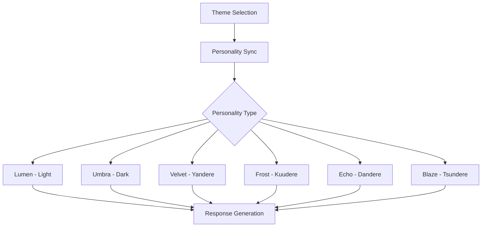
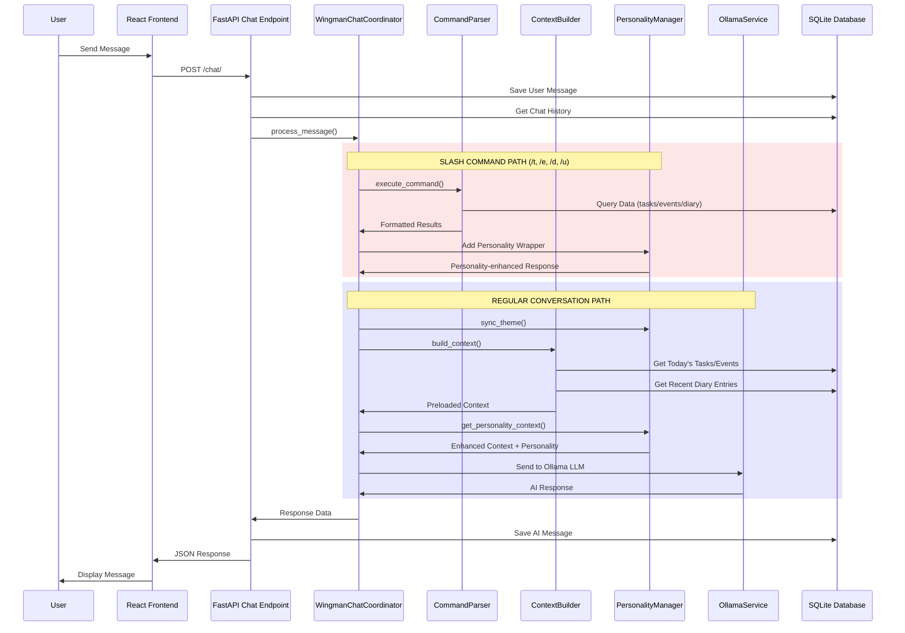
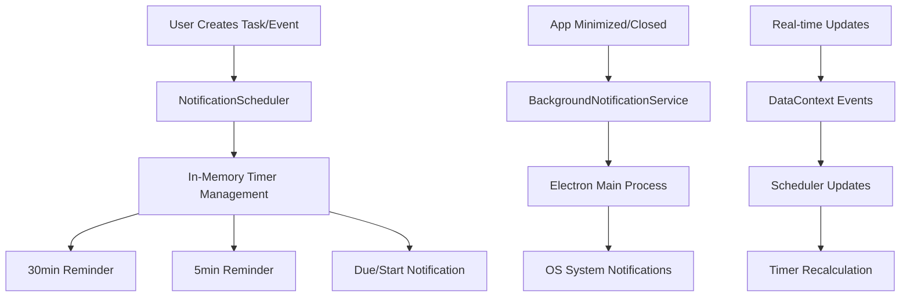
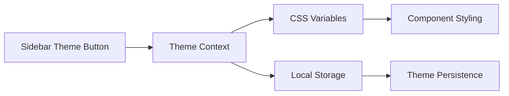
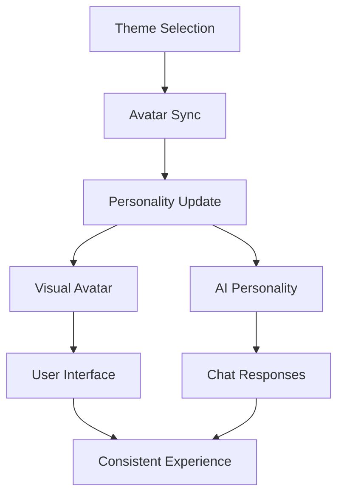
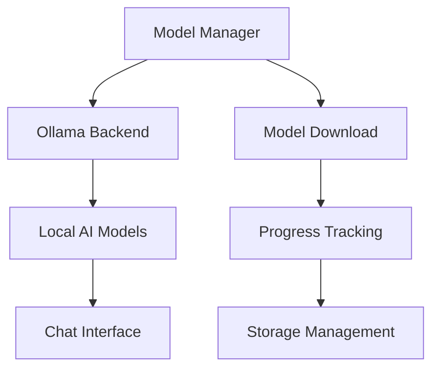
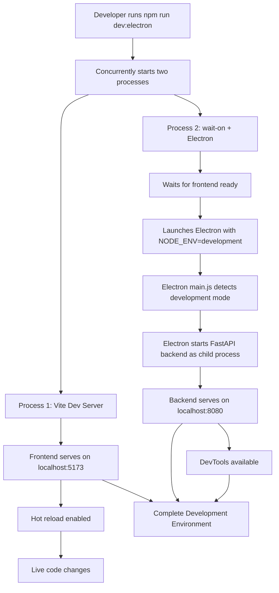
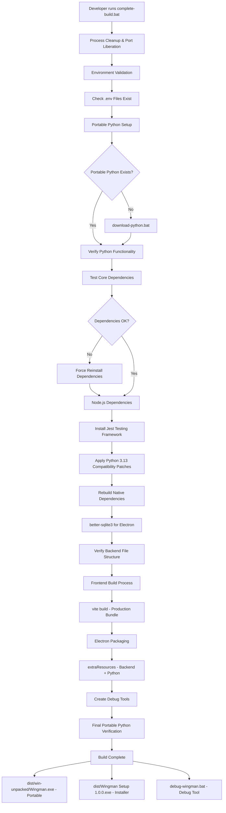

# Wingman - Personal Assistant

<p align="center">
  
  
</p>

> A comprehensive personal assistant desktop application featuring task management, calendar scheduling, diary journaling, AI chat integration, and advanced automation capabilities. Built with React, TypeScript, Electron, and Python.

## Prerequisites & Setup Requirements

**Quick Start - Only Ollama Required!**

### Required Software Installation

**Ollama (For AI Features - MANDATORY)**
Download and install Ollama from:
https://ollama.com/download/OllamaSetup.exe

**Python 3.13 - Now Auto-Installed! 🎉**
Wingman automatically handles Python installation - no manual setup needed!

### Installation Guide **(Outdated - Will be Updated)**

https://drive.google.com/file/d/14EyaZ1VHXKQoU_O_s3SXYPxB2aiKdZmk/view?usp=drive_link

### WHERE TO DOWNLOAD?

https://github.com/Yxiang-828/Wingman/tags

^^ always check out releases page for the latest updates then download the setup.exe

### Supported AI Models

- llama3.2:1b/3b/8b
- deepseek-r1:1.5b/7b/14b
- mistral:7b

### What's New in Milestone 3

**🎯 Finalized offline functionality and LLM chat integration**

**🤖 Added Mistral AI as an LLM option for smooth prompting**

**👤 Added comprehensive avatar system with personality themes**

**🧪 Implemented robust testing framework with Jest**

**✨ Enhanced UI polish and bug fixes for production**

**⚡ Optimized performance and cleaned up codebase**

**🚀 Ready for deployment with all core features complete**

*💡 Tip: Head to Wingman chatbot right away and type '/guide'!*

### Prerequisites (Updated for Milestone 3)

**1. Ollama (For AI Features - MANDATORY)**
Download and install Ollama from:
https://ollama.com/download/OllamaSetup.exe

**2. Python 3.13 (Auto-Installed)**
Wingman now automatically installs Python 3.13 for you! No manual installation required.

*If backend fails to start, you can manually install Python 3.13:*
- For Windows 64-bit: https://www.python.org/ftp/python/3.13.0/python-3.13.0-amd64.exe
- For others: https://www.python.org/downloads/

### Troubleshooting

**If backend fails to start, manual Python installation:**
- Windows 64-bit: https://www.python.org/ftp/python/3.13.0/python-3.13.0-amd64.exe  
- Others: https://www.python.org/downloads/
- **Remember to check "Add Python to PATH" during installation**

**AI Model Downloads**

If you can't download LLM models in the app:

1. Open Command Prompt (Win+R → cmd)
2. Check available models: `ollama list`
3. Download model manually: `ollama run "your-desired-model"`
4. Return to the app after downloading

<p align="center">
  
  
  
  
  
  
  
  
</p>

## Table of Contents

- [Overview](#overview)
- [Core Features](#core-features)
  - [Dashboard & Home](#dashboard--home)
  - [Calendar Management](#calendar-management)
  - [Task Management](#task-management)
  - [Recurring Tasks](#recurring-tasks)
  - [Diary & Journaling](#diary--journaling)
  - [AI Chat Assistant](#ai-chat-assistant)
  - [Background Notifications](#background-notifications)
- [Customization](#customization)
  - [Theme System](#theme-system)
  - [Avatar & Personality](#avatar--personality)
- [AI Integration](#ai-integration)
  - [Model Manager](#model-manager)
  - [Ollama Integration](#ollama-integration)
- [Data Management](#data-management)
  - [Local-First Architecture](#local-first-architecture)
  - [Data Export & Cleanup](#data-export--cleanup)
  - [Privacy & Security](#privacy--security)
- [Technical Architecture](#technical-architecture)
  - [System Overview](#system-overview)
  - [File Structure](#file-structure)
  - [Development vs Production](#development-vs-production)
- [Installation & Setup](#installation--setup)
  - [Prerequisites](#prerequisites)
  - [Quick Start](#quick-start)
  - [Development Setup](#development-setup)
- [Troubleshooting](#troubleshooting)
  - [Common Issues](#common-issues)
  - [Deployment Problems](#deployment-problems)
- [Performance & Optimization](#performance--optimization)
- [Roadmap](#roadmap)
- [Contributing](#contributing)

---

## Overview

Wingman is a sophisticated personal assistant application that combines productivity tools with AI-powered features in a beautiful, desktop-native interface. Built on a hybrid architecture that prioritizes local-first data storage while leveraging cloud authentication, Wingman offers the perfect balance of performance, privacy, and functionality.

### Key Highlights

- **Local-First Design**: All your data stays on your device with SQLite storage
- **Cloud Authentication**: Secure user accounts via Supabase
- **AI-Ready**: Full Ollama integration for local AI models
- **Professional Notifications**: Smart background notification system
- **Advanced Automation**: Recurring tasks with intelligent generation
- **Beautiful Theming**: Six complete theme variants
- **Cross-Platform**: Desktop application for Windows, macOS, and Linux

## Tech Stack

### Frontend

- **React 18** + **TypeScript** - Modern, type-safe UI development
- **React Router** - Navigation and routing
- **Context API** - Global state management with optimized caching
- **Vite** - Fast build tool and development server

### Backend

- **FastAPI** - High-performance Python web framework
- **Supabase** - PostgreSQL database with realtime capabilities
- **Python 3.13** - Latest Python features with compatibility patches

### Desktop

- **Electron** - Cross-platform desktop wrapper
- **Inter-process communication** - Seamless frontend-backend integration

## Simulated dev-setup routine (For user-testing, please head to releases page)

### Installation

#### 1. Clone Repository

```bash
git clone https://github.com/yourusername/Wingman.git
cd Wingman
```

#### 2. Run Complete Build Setup

```bash
# This installs all dependencies and sets up the environment
.\complete-build.bat
```

#### 3. Create Environment Files

Create `.env` in the root directory:

```
VITE_SUPABASE_URL=your_supabase_url
VITE_SUPABASE_KEY=your_supabase_key
```

Create `Wingman-backend/.env`:

```
SUPABASE_URL=your_supabase_url
SUPABASE_KEY=your_supabase_key
```

#### 4. Start Development Environment

```bash
# Start development mode
npm run dev:electron
```

## Usage

### Navigation

- **Dashboard** - View today's tasks, events, and statistics
- **Calendar** - Manage schedule with multiple views
  - Day View - Detailed view of single day
  - Week View - Overview of current week
  - Month View - Monthly calendar with sleek selector
- **Diary** - Record thoughts and track mood
- **Wingman** - Chat with AI assistant

### Key Functions

- **Task Management** - Create, edit, complete, and track tasks
- **Event Scheduling** - Plan meetings and personal events
- **Journaling** - Write diary entries with mood tracking
- **AI Chat** - Get help and suggestions from the assistant

---

## Dashboard & Home

The Dashboard serves as Wingman's central command center, providing a comprehensive overview of your daily activities and schedule.

### Overview Dashboard

The main dashboard displays:

- **Today's Summary**: Quick statistics showing today's events, pending tasks, and completed tasks
- **Pending Tasks**: Interactive list of today's incomplete tasks with one-click completion
- **Calendar Events**: Today's scheduled events sorted by time priority
- **Completed Tasks**: Tasks you've finished today with satisfaction tracking
- **Recent Diary Entries**: Your latest thoughts and reflections (up to 5 entries)

### Key Features

- **Real-time Updates**: Dashboard automatically refreshes when tasks or events are modified
- **One-Click Task Completion**: Complete tasks directly from the dashboard with instant feedback
- **Smart Notifications**: Receive congratulation notifications when completing tasks
- **Quick Navigation**: Click any card to jump to the full feature (tasks, calendar, diary)
- **Loading State**: Professional loading screen while your data loads

### Dashboard Layout

```
┌─────────────────────────┐
│    Today's Summary      │
│  Events: 3  Tasks: 5    │
│    Completed: 2         │
└─────────────────────────┘

┌──────────────┐ ┌──────────────┐
│ Pending      │ │ Today's      │
│ Tasks        │ │ Events       │
│              │ │              │
└──────────────┘ └──────────────┘

┌──────────────┐ ┌──────────────┐
│ Completed    │ │ Recent       │
│ Tasks        │ │ Diary        │
│              │ │              │
└──────────────┘ └──────────────┘
```

### Task Management

- View all pending tasks for today
- Complete tasks with checkbox interaction
- Automatic task failure detection for overdue items
- Support for both regular and recurring tasks
- Task detail popups for additional information

### Integration

The dashboard integrates seamlessly with:

- **Task System**: Real-time task status updates
- **Calendar System**: Today's events with time-based sorting
- **Diary System**: Recent entries for quick reference
- **Notification System**: Task completion celebrations
- **Theme System**: Consistent styling across all cards

## Calendar Management

Wingman's calendar system provides comprehensive scheduling capabilities with multiple view options and intelligent event management.

### Calendar Views

#### Day View

- **Detailed daily planning** with dual-pane layout for tasks and events
- **Time-based scheduling** with optional time inputs for precise planning
- **Inline task creation** with support for both regular and recurring tasks
- **Event management** with create, edit, and delete functionality
- **Quick navigation** between dates with arrow controls
- **Tab switching** between events and tasks views

#### Week View

- **7-day overview** starting from Monday (configurable)
- **Compact item display** with performance optimization (12 items per day max)
- **Interactive day cells** with click-to-navigate functionality
- **Today highlighting** for current date awareness
- **Overflow handling** for days with many items
- **Quick access** to detailed day view

#### Month View

- **Year-at-a-glance** with month selector grid
- **Quick navigation** to any month in the current year
- **Month abbreviations** for compact display
- **Direct navigation** to week view from month selection
- **Year navigation** for planning ahead

### Event Management

#### Event Creation

- **Event Modal** with comprehensive form fields:
  - Title (required)
  - Date selection with calendar picker
  - Optional time specification
  - Event type categorization (Personal, Work, etc.)
  - Detailed description support
- **Validation system** with error feedback
- **Default date handling** based on current view context

#### Event Features

- **Event types** for categorization and filtering
- **All-day and timed events** support
- **Event editing** with pre-populated forms
- **Event deletion** with confirmation
- **Event time sorting** for logical daily organization

### Task Integration

The calendar seamlessly integrates with the task management system:

- **Task creation** directly from day view
- **Recurring task setup** with weekday selection
- **Task completion** tracking within calendar context
- **Task time scheduling** for time-blocking productivity
- **Task failure detection** for overdue items

### Navigation & UX

```
Calendar Navigation:
┌─────────────────────────────────┐
│ [Day] [Week] [Month] [Today]    │
│ ← 2025-01-15 →                  │
└─────────────────────────────────┘

Day View Layout:
┌──────────────┐ ┌──────────────┐
│   [Events]   │ │   [Tasks]    │
│              │ │              │
│ • Meeting    │ │ □ Call John  │
│ • Lunch      │ │ ☑ Review     │
│              │ │              │
└──────────────┘ └──────────────┘
```

### Error Handling

- **Error boundary** protection for calendar components
- **Graceful degradation** with fallback UI
- **Error logging** for debugging and monitoring
- **Reload functionality** for error recovery

### Performance Features

- **Memoized components** for efficient re-rendering
- **Item limits** on week view to prevent UI overflow
- **Lazy loading** of calendar data
- **Optimized date calculations** using date-fns library

## Task Management

Wingman's task management system provides comprehensive task tracking with intelligent automation and failure detection capabilities.

### Core Task Features

#### Task Creation

- **Multiple creation methods**: Dashboard, Calendar Day View, or dedicated task interface
- **Time scheduling**: Optional time specification for precise planning
- **Task types**: Support for regular and recurring tasks
- **Validation system**: Ensures required fields are properly filled
- **Instant UI feedback**: Optimistic updates with background persistence

#### Task Tracking & Status

```
Task Lifecycle:
┌─────────────┐    ┌─────────────┐    ┌─────────────┐
│   Pending   │ -> │  Completed  │    │   Failed    │
│             │    │             │    │             │
└─────────────┘    └─────────────┘    └─────────────┘
       │                                     ▲
       └─────────────────────────────────────┘
              (Auto-fail when overdue)
```

- **Pending Tasks**: Active tasks awaiting completion
- **Completed Tasks**: Successfully finished tasks with celebration notifications
- **Failed Tasks**: Automatically marked when overdue (time-based detection)
- **Status Persistence**: All states saved in local SQLite database

#### Task Completion System

- **One-click completion**: Complete tasks from Dashboard or Calendar views
- **Congratulation notifications**: Instant positive feedback system
- **Automatic UI updates**: Real-time dashboard refresh
- **Multi-layer support**: Works across Dashboard, Calendar Day View, and task lists
- **Undo functionality**: Restore completed tasks to pending status

### Advanced Task Features

#### Automatic Failure Detection

The system automatically detects and marks overdue tasks:

- **Time-based checking**: Compares current time with task deadlines
- **Smart detection**: The app only checks today’s tasks that have a specific time set, which saves processing power by focusing only on tasks that could actually fail soon instead of checking ones that don’t need it.
- **Immediate marking**: Updates task status in real-time
- **Visual indicators**: Failed tasks display with warning styling
- **Notification alerts**: OS notifications for newly failed tasks

#### Task Data Management

- **SQLite storage**: All tasks stored locally for instant access
- **Data persistence**: Survives application restarts
- **Optimized queries**: Efficient database operations with proper indexing
- **Data validation**: Type-safe operations with error handling
- **Automatic timestamps**: Creation and update tracking

### Task Display & Organization

#### Dashboard Integration

- **Today's summary**: Quick stats showing total, pending, and completed tasks
- **Priority display**: Failed tasks shown prominently
- **Interactive cards**: Click to view details or navigate to full view
- **Real-time updates**: Automatic refresh when tasks change

#### Calendar Integration

- **Day view**: Full task management within calendar context
- **Time-based sorting**: Tasks ordered by scheduled time
- **Visual grouping**: Pending, completed, and failed tasks clearly separated
- **Inline editing**: Modify tasks directly in calendar view

#### Completed Tasks View

- **Historical tracking**: View completed tasks by date
- **Date filtering**: Focus on specific days or view all completions
- **Satisfaction metrics**: Track productivity over time
- **Quick access**: Navigate from dashboard or dedicated menu

### Task Types & Extensions

#### Regular Tasks

- **Standard workflow**: Create, complete, and track individual tasks
- **Flexible timing**: Support for all-day or time-specific tasks
- **Easy modification**: Edit title, time, or delete as needed

#### Recurring Tasks

(Detailed in the next section)

### Performance & UX Features

- **Optimistic UI**: Instant visual feedback before database confirmation
- **Error boundaries**: Graceful handling of task operation failures
- **Loading states**: while the app is performing a task operation, it shows a clear sign (like a loader) so you know it’s in progress.
- **Keyboard shortcuts**: Efficient task interaction patterns
- **Mobile responsive**: Touch-friendly task interaction

## Recurring Tasks

Wingman's recurring task system provides intelligent automation for routine activities with advanced template management and generation capabilities.

### Recurring Task Architecture

```
Template System:
┌─────────────────┐    ┌─────────────────┐    ┌─────────────────┐
│ Recurring       │ -> │ Daily Task      │ -> │ Completed       │
│ Template        │    │ Generation      │    │ Instance        │
│ (M,T,W,T,F)     │    │ (Auto-create)   │    │ (Track Progress)│
└─────────────────┘    └─────────────────┘    └─────────────────┘
```

### Template Management

#### Creating Recurring Templates

- **Access via Profile Settings**: Comprehensive template creation interface
- **Task title specification**: What task should be created
- **Time scheduling**: Optional specific time for task generation
- **Weekday selection**: Choose which days (0=Sunday, 6=Saturday)
- **Active status**: Enable/disable templates without deletion
- **Form validation**: Ensures required fields and valid time formats

#### Template Features

- **Persistent storage**: Templates saved in SQLite `recurring_tasks` table
- **User isolation**: Each user's templates are completely separate
- **JSON weekday storage**: Flexible weekday configuration as JSON arrays
- **Template versioning**: Update templates without affecting existing tasks
- **Bulk operations**: Enable/disable multiple templates at once

### Automatic Task Generation

#### Generation Logic

The system automatically creates task instances from active templates:

- **Daily check**: Each time you open the app (or whenever you tell it to), it runs a check to see if it needs to create new tasks for today.
- **Weekday matching**: Templates might say “only Mondays and Wednesdays.” The app only creates tasks on those days.
- **Duplicate prevention**: If a task from that template already exists for today, it won’t create another copy.
- **Smart timing**: The template might include a specific time (like 9:00 AM) or just say “all-day.” The app follows that.
- **Error resilience**:If something goes wrong while creating a task from one template, it logs the error but keeps generating tasks from the other templates instead of stopping completely.

#### Generation Triggers

- **Application startup**: When you launch the app, it checks and makes sure today’s tasks are there.
- **Manual generation**: You can press a button in the dashboard or settings to trigger generation yourself.
- **Date-specific**: You can tell it to generate tasks not just for today but also for a past date or future date (for planning).
- **Bulk creation**:You can ask it to generate tasks for several days at once, not just one day.

### Technical Implementation

#### Database Schema

```sql
recurring_tasks table:
- id (primary key)
- user_id (foreign key)
- task_title (task name)
- task_time (optional HH:MM)
- weekdays (JSON array [0,1,2,3,4,5,6])
- is_active (boolean)
- created_at (timestamp)

Generated tasks link via:
- recurring_id (references recurring_tasks.id)
```

#### Generation Algorithm

1. **Find active templates** for the user
2. **Parse weekday arrays** from JSON storage
3. **Check current day** against template weekdays
4. **Verify no existing tasks** for this template + date
5. **Create new task instances** with recurring_id reference
6. **Log generation results** with success/failure counts

### User Experience

#### Visual Indicators

- **Recurring badges**: ♻️ symbol on generated tasks
- **Template status**: Clear active/inactive states in settings
- **Generation feedback**: Success messages and task counts
- **Error handling**: Clear error messages for invalid templates

#### Management Interface

- **Template list**: View all recurring templates in Profile Settings
- **Quick actions**: Edit, activate/deactivate, or delete templates
- **Generation controls**: Manual trigger for today's tasks
- **Statistics**: See how many tasks created from each template

### Advanced Features

#### Template Validation

- **Title requirements**: Non-empty task titles mandatory
- **Time format validation**: HH:MM format with range checking
- **Day of the week validation**: Array of numbers 0-6 only
- **JSON parsing**: Graceful handling of malformed weekday data

#### Intelligent Scheduling

- **No conflicts**: Won't create duplicate tasks for same template + date
- **Historical generation**: Can create tasks for past dates
- **Future planning**: Generate tasks for upcoming weeks
- **Timezone awareness**: All times in user's local timezone

#### Error Recovery

- **Partial failures**: Some templates can fail without affecting others
- **Detailed logging**: Complete audit trail of generation attempts
- **Graceful degradation**: UI remains functional even with database errors
- **Retry mechanisms**: Failed generations can be manually retried

### Integration Points

- **Task system**: Generated tasks behave like regular tasks
- **Calendar views**: Recurring tasks appear in all calendar interfaces
- **Dashboard**: Recurring tasks included in daily summaries
- **Notifications**: Generated tasks participate in notification system
- **Completion tracking**: Completed recurring tasks tracked like regular tasks

## Diary & Journaling

Wingman's diary system provides an immersive journaling experience with mood tracking, intelligent organization, and powerful search capabilities.

### Writing Experience

#### Immersive Writing Mode

- **Distraction-free environment**: Automatically hides sidebar during writing
- **Mood-responsive theming**: Visual ambiance adapts to selected emotional state
- **Auto-expanding text area**: Writing space grows as content increases
- **Focus preservation**: Maintains cursor position during template insertions

#### Writing Assistance Tools

- **Writing prompts**: 14 thoughtful conversation starters to inspire reflection
  - "What made you smile today, boss?"
  - "What's one thing you learned recently?"
  - "How would you describe your current mood in detail?"
  - And 11 more personalized prompts
- **Quick entry templates**: Pre-structured formats for rapid journaling
  - Grateful: "Today I'm grateful for:"
  - Reflect: "When I reflect on today, I realize:"
  - Goals: "My goals for tomorrow are:"
  - Feelings: "Right now I'm feeling:"

### Mood System

#### Mood Selection & Tracking

```
Available Mood States:
┌─────────────────────────────────────────────────┐
│ 😊 Happy    😢  Sad         😐 Neutral        │
│ 🤩 Excited  😰 Anxious                         │
└─────────────────────────────────────────────────┘
```

- **Visual mood indicators**: Emoji representations for quick recognition
- **Mood-based styling**: Interface colors and effects match emotional state
- **Filtering capabilities**: Search and organize entries by mood
- **Mood analytics**: Track emotional patterns over time

### Entry Management

#### Creating Entries

- **Title requirement**: All entries must have descriptive titles
- **Date handling**: The system sets the date to the current date by default, but you can manually change it if needed.
- **Content preservation**: Auto-save functionality prevents data loss
- **Validation system**: Ensures complete entries before saving

#### Entry Organization

- **Month-based grouping**: Entries automatically organized by creation month
- **Chronological sorting**: Most recent entries appear first within each month
- **Expandable months**: Click to show/hide entries from specific time periods
- **Auto-expand recent**: The current month is automatically opened when the page loads.

### Search & Discovery

#### Advanced Search Features

- **Multi-parameter search**: Combine text, date range, and mood filters
- **Real-time filtering**: Results update as you type
- **Content matching**: Searches both titles and full entry content
- **Date range selection**: Find entries from specific time periods
- **Mood-based filtering**: Locate entries by emotional state

#### Search Interface

- **Debounced search**: Performance-optimized with 500ms delay
- **Clear filters**: Easy reset to start fresh searches
- **Recent entries**: Quick access to last 8 entries
- **Result highlighting**: Visual emphasis on matching terms

### Entry Details & Actions

#### Detail Popup System

- **Click-positioned popups**: Details appear near the clicked entry
- **Full content display**: Read entire entries without navigation
- **Action buttons**: Edit, delete, or close directly from popup
- **Responsive positioning**: Adapts to screen boundaries

#### Entry Actions

- **Edit functionality**: Modify existing entries with pre-populated forms
- **Safe deletion**: Confirmation prompts prevent accidental loss
- **Success feedback**: Clear messages confirm completed actions
- **Navigation state**: Preserves context when moving between views

### Technical Architecture

#### Data Storage

- **SQLite persistence**: All entries stored in local database
- **User isolation**: Complete privacy with user-specific data
- **Date normalization**: Consistent YYYY-MM-DD format handling
- **Field validation**: Type-safe operations with proper error handling

#### Context Management

- **DiaryContext**: Centralized state management for all diary operations
- **Real-time updates**: Automatic refresh after create/edit/delete operations
- **Loading states**: User-friendly indicators during data operations
- **Error recovery**: Graceful handling of database connectivity issues

### User Experience Features

#### Navigation & Routing

- **Multi-view routing**: Write, view, search, and edit modes
- **State preservation**: Maintains form data during navigation
- **Success messages**: Confirmation feedback for all operations
- **Breadcrumb navigation**: Breadcrumb navigation shows a trail of clickable links (like Home > Entries > Edit Entry) at the top of the interface, giving users a clear sense of where they are and a quick way to go back.

#### Visual Design

- **Themed consistency**: Integrates with Wingman's overall design system
- **Responsive layout**: Optimized for both desktop and mobile
- **Accessibility**: Keyboard navigation and screen reader support
- **Performance optimization**: Memoized components and efficient rendering

## AI Chat Assistant

Wingman's AI chat system delivers intelligent, personality-driven conversations with sophisticated context preloading and command execution capabilities.

### LLM Infrastructure

#### Personality System

Wingman features **6 distinct AI personalities** that synchronize with your selected theme:


```mermaid
graph TD
    A[Theme Selection] --> B[Personality Sync]
    B --> C{Personality Type}
    C --> D[Lumen - Light]
    C --> E[Umbra - Dark] 
    C --> F[Velvet - Yandere]
    C --> G[Frost - Kuudere]
    C --> H[Echo - Dandere]
    C --> I[Blaze - Tsundere]
    
    D --> J[Response Generation]
    E --> J
    F --> J
    G --> J
    H --> J
    I --> J
```

**Personality Characteristics:**

| Personality | Name | Traits | Response Style | Emoji Usage |
|-------------|------|--------|----------------|-------------|
| **Light** | Lumen | Optimistic, encouraging, warm | Positive reinforcement | Moderate (☀️, ✨, 💫) |
| **Dark** | Umbra | Analytical, direct, efficient | Minimal but insightful | Minimal (🌑, ⚡, 🔍) |
| **Yandere** | Velvet | Intensely loyal, protective | Highly personalized | Selective (💖, 👁️, 🔒) |
| **Kuudere** | Frost | Reserved, logical, professional | Analytical with hidden care | Rare (❄️, 📊, 💙) |
| **Dandere** | Echo | Gentle, shy, soft-spoken | Quiet encouragement | Sweet (🌸, 💕, 🌼) |
| **Tsundere** | Blaze | Initially distant, caring underneath | Reluctant but thorough | Conflicted (😤, 💢, 💖) |

#### Slash Commands

Wingman supports **4 primary slash commands** for instant data access:

```
/t - Tasks        /e - Events       /d - Diary        /u - Users
```

**Command Structure:**
```
/{table} /{filter} {parameter} [options]
Examples:
- /t /date 2025-01-15    (tasks on specific date)
- /e /month jan          (events in January) 
- /d /mood happy         (diary entries by mood)
- /u /username           (user information)
```

**Pagination Support:**
- Results limited to **50 items** (15 for diary entries)
- `/more` command for additional results
- Smart pagination maintains query state

#### Context Preloading

Wingman intelligently preloads relevant context for every conversation:

**Preloading Limits:**
- **10 recent chat messages** for conversation flow
- **8 daily items** (tasks/events) for performance
- **3 recent diary entries** for emotional context
- **100 maximum results** for slash commands

**Preloaded Data Structure:**
```
📋 TODAY'S TASKS (2025-01-28):
   • Morning workout at 07:00 [⏳ PENDING]
   • Team meeting at 10:00 [✅ COMPLETED]

📅 TODAY'S EVENTS (2025-01-28):
   • Lunch with Sarah at 12:30 (Personal)
   • Project review at 15:00 (Work)

📓 RECENT DIARY:
   • 2025-01-27: Had a productive day... [Mood: happy]
   • 2025-01-26: Feeling overwhelmed... [Mood: anxious]
```

### Technical Architecture

#### AI Communication Flow


```mermaid
sequenceDiagram
    participant U as User
    participant FE as React Frontend
    participant API as FastAPI Chat Endpoint
    participant CC as WingmanChatCoordinator
    participant CP as CommandParser
    participant CB as ContextBuilder
    participant PM as PersonalityManager
    participant OS as OllamaService
    participant DB as SQLite Database
    
    U->>FE: Send Message
    FE->>API: POST /chat/
    API->>DB: Save User Message
    API->>DB: Get Chat History
    API->>CC: process_message()
    
    rect rgb(255, 230, 230)
        Note over CC,PM: SLASH COMMAND PATH (/t, /e, /d, /u)
        CC->>CP: execute_command()
        CP->>DB: Query Data (tasks/events/diary)
        CP->>CC: Formatted Results
        CC->>PM: Add Personality Wrapper
        PM->>CC: Personality-enhanced Response
    end
    
    rect rgb(230, 230, 255)
        Note over CC,OS: REGULAR CONVERSATION PATH
        CC->>PM: sync_theme()
        CC->>CB: build_context()
        CB->>DB: Get Today's Tasks/Events
        CB->>DB: Get Recent Diary Entries
        CB->>CC: Preloaded Context
        CC->>PM: get_personality_context()
        PM->>CC: Enhanced Context + Personality
        CC->>OS: Send to Ollama LLM
        OS->>CC: AI Response
    end
    
    CC->>API: Response Data
    API->>DB: Save AI Message
    API->>FE: JSON Response
    FE->>U: Display Message
```

#### Technical Architecture

**Core Flow Control:**

1. **WingmanChatCoordinator**: Single entry point that routes between slash commands and LLM conversations
2. **Dual Processing Modes**: Instant command execution vs context-enhanced LLM chat
3. **WingmanCommandParser**: Direct database queries with formatted markdown tables
4. **WingmanContextBuilder**: Preloads today's data + recent history for LLM context
5. **WingmanPersonalityManager**: Theme-synchronized personality injection
6. **WingmanOllamaService**: Direct HTTP communication with local Ollama server

#### Data Storage & Privacy

**Local-First Architecture:**
- **SQLite storage**: All chat history stored locally 
- **No cloud dependency**: Conversations never leave your machine
- **User isolation**: Complete privacy with per-user histories
- **Automatic cleanup**: Configurable message retention

**Performance Optimization:**
- **Context caching**: Efficient data aggregation
- **Streaming responses**: Real-time AI response generation
- **Memory management**: Smart cleanup of conversation data
- **Query optimization**: Indexed database queries with limits

### Avatar & Personality Integration

#### Theme-Avatar Synchronization

Wingman's avatar system seamlessly integrates with AI personalities:

**Theme-Avatar Mapping:**
```typescript
themePersonalityMap = {
  light: { personality: "light", avatar: lightAvatar, name: "Lumen" },
  dark: { personality: "dark", avatar: darkAvatar, name: "Umbra" },
  yandere: { personality: "yandere", avatar: yandereAvatar, name: "Velvet" },
  kuudere: { personality: "kuudere", avatar: kuudereAvatar, name: "Frost" },
  dandere: { personality: "dandere", avatar: dandereAvatar, name: "Echo" },
  tsundere: { personality: "tsundere", avatar: tsundereAvatar, name: "Blaze" }
}
```

**Real-time Synchronization:**
- Theme changes instantly update AI personality
- Avatar appearance matches personality traits
- Consistent experience across all app components
- Mood-responsive visual feedback

#### Response Formatting

Each personality formats data uniquely:

**Task List Examples:**
- **Light**: "Here are your tasks! ✨ You've got this!"
- **Dark**: "Task list:" (minimal formatting)
- **Yandere**: "All your tasks... I'll help you with every single one 💖"
- **Kuudere**: "Your task schedule: Not that I expect you to complete them all."
- **Dandere**: "I... I made a nice table for your tasks... 🌸"
- **Tsundere**: "Here are your tasks! Don't procrastinate! 😤"

### User Experience Features

#### Intelligent Conversation Flow

- **Context-aware responses**: AI references your actual data
- **Personality consistency**: Maintains character throughout conversations
- **Command integration**: Seamless slash command execution
- **Error handling**: Personality-appropriate error messages

#### Health Monitoring

- **Service status**: Real-time Ollama availability checking (30-second intervals)
- **Error recovery**: Graceful fallbacks when AI unavailable
- **Status indicators**: Visual feedback for AI readiness
- **Retry mechanisms**: Automatic reconnection attempts

#### Quick Start Guide

**New to Wingman? Get started instantly!**
Type `/guide` in the chat to access the comprehensive setup guide and learn about all features.

## Background Notifications

Wingman features a sophisticated, multi-layered notification system that ensures you never miss important tasks or events, even when the app is minimized or closed.

#### System Architecture

The notification system uses a modern event-driven architecture with three complementary layers:


```mermaid
graph TD
    A[User Creates Task/Event] --> B[NotificationScheduler]
    B --> C[In-Memory Timer Management]
    C --> D[30min Reminder]
    C --> E[5min Reminder]
    C --> F[Due/Start Notification]

    G[App Minimized/Closed] --> H[BackgroundNotificationService]
    H --> I[Electron Main Process]
    I --> J[OS System Notifications]

    K[Real-time Updates] --> L[DataContext Events]
    L --> M[Scheduler Updates]
    M --> N[Timer Recalculation]
```

#### Core Components

**1. NotificationScheduler (Frontend)**

- Professional in-memory scheduler using JavaScript timers
- Loads data once at startup, maintains real-time state
- Triggers notifications at calculated intervals: 30 minutes, 5 minutes, and due time
- Updates automatically via DataContext events (no database polling)

**2. BackgroundNotificationService (Electron Main Process)**

- Keeps notifications running when app is minimized or closed
- Persistent user session management across app restarts
- Native OS notifications through Electron's Notification API
- Prevents duplicate notifications with intelligent state tracking

**3. OSNotificationManager (Fallback)**

- Browser-based notification system for web environments
- Graceful degradation when Electron notifications unavailable
- Configurable reminder intervals and notification types

#### Features

**Smart Timing System**

- **30-minute reminders**: Early warning for upcoming tasks/events
- **5-minute alerts**: Final preparation notifications
- **Due/start notifications**: Immediate alerts when items become due
- **Overdue detection**: Automatic failure detection for missed tasks

**Background Operation**

- Continues running when app is closed or minimized
- Persists user session across app restarts
- Uses native OS notifications for maximum visibility
- Automatic cleanup of expired notifications

**Real-time Updates**

- Instant scheduler updates when tasks/events are modified
- Timer recalculation on time changes
- Automatic removal of completed/cancelled items
- No database polling - pure event-driven architecture

**Permission Management**

- Automatic browser notification permission requests
- Graceful fallback to alert dialogs if permissions denied
- OS-level notification support through Electron

#### Configuration

The system supports various configuration options:

```typescript
interface NotificationConfig {
  checkIntervalMs: number; // Polling interval (60 seconds)
  task30minReminder: boolean; // 30-min task reminders
  task5minReminder: boolean; // 5-min task reminders
  event30minReminder: boolean; // 30-min event reminders
  event5minReminder: boolean; // 5-min event reminders
  enableLogging: boolean; // Debug logging
}
```

#### Technical Implementation

**Event-Driven Architecture**

- Follows Slack/Discord patterns for scalable notification systems
- Single data load at startup with real-time event updates
- JavaScript timers for precise notification timing
- No database polling for optimal performance

**State Management**

- In-memory notification state with persistent user session
- Duplicate notification prevention
- Automatic cleanup of expired items
- Concurrent update protection

**Error Handling**

- Graceful degradation across notification methods
- Automatic retry for failed notifications
- Comprehensive error logging and recovery

The notification system ensures reliable, timely alerts while maintaining excellent performance through modern architectural patterns and intelligent state management.

## Customization

Wingman offers extensive customization options to create a personalized productivity environment that matches your workflow and style preferences.

### Theme System

**Six Distinct Themes Available:**

- **Dark**: Professional dark interface (default)
- **Light**: Clean, bright workspace theme
- **Yandere**: Passionate pink with obsessive love vibes
- **Kuudere**: Cool blue with hidden warmth
- **Tsundere**: Fiery orange that's definitely not cute
- **Dandere**: Gentle purple for shy personalities

**Theme Management:**

- **Quick Cycling**: Click the theme button in the sidebar to cycle through themes
- **Visual Feedback**: Each theme has a unique emoji indicator (🌙, ☀️, 🌸, ❄️, 🧡, 💜)
- **Settings Access**: Detailed theme selection available in Profile Settings
- **Real-time Preview**: Instant theme switching with no restart required

**Theme Backgrounds:**

<div align="center">
<table>
<tr>
<td align="center"><br/><b>🌙 Dark</b></td>
<td align="center"><br/><b>☀️ Light</b></td>
<td align="center"><br/><b>🌸 Yandere</b></td>
</tr>
<tr>
<td align="center"><br/><b>❄️ Kuudere</b></td>
<td align="center"><br/><b>🧡 Tsundere</b></td>
<td align="center"><br/><b>💜 Dandere</b></td>
</tr>
</table>
</div>


```mermaid
graph LR
    A[Sidebar Theme Button] --> B[Theme Context]
    B --> C[CSS Variables]
    C --> D[Component Styling]
    B --> E[Local Storage]
    E --> F[Theme Persistence]
```

### Avatar & Personality System

Wingman features a comprehensive avatar system with **6 specialized personalities** that integrate seamlessly with themes and AI interactions.

#### Avatar Architecture


```mermaid
graph TD
    A[Theme Selection] --> B[Avatar Sync]
    B --> C[Personality Update]
    C --> D[Visual Avatar]
    C --> E[AI Personality]
    D --> F[User Interface]
    E --> G[Chat Responses]
    F --> H[Consistent Experience]
    G --> H
```

#### Personality Profiles

**6 Distinct Wingman Personalities:**

| Avatar | Name | Personality Type | Core Traits | Communication Style |
|--------|------|------------------|-------------|-------------------|
|  | **Lumen** | Supportive Buddy | Optimistic, encouraging, warm | Positive reinforcement with helpful suggestions |
|  | **Umbra** | Strategic Advisor | Analytical, direct, efficient | Minimal but insightful responses |
|  | **Velvet** | Devoted Companion | Intensely loyal, protective | Highly personalized, remembers everything |
|  | **Frost** | Professional Assistant | Reserved, logical, gradually warming | Analytical with hidden concern |
|  | **Echo** | Gentle Guide | Shy, soft-spoken, deeply caring | Quiet encouragement and soft support |
|  | **Blaze** | Dynamic Motivator | Initially distant, caring underneath | Reluctant help with underlying affection |

#### Avatar Customization Features

**Visual Customization:**
- **Avatar Categories**: Professional, Friendly, Futuristic styles
- **Dynamic Generation**: Powered by DiceBear API for unique avatars
- **Real-time Preview**: Instant visual feedback during customization
- **Appearance Sync**: Avatar appearance reflects personality traits

**Personality Integration:**
- **Contextual Responses**: Mood-aware interactions based on current context
- **Consistent Behavior**: Personality maintained across all app interactions  
- **Adaptive Communication**: Response style adapts to diary mood and app context
- **Memory System**: Personality preferences persist across sessions

#### Customization Process

**Step-by-Step Avatar Creation:**

1. **Access Settings**: Profile → Design Your Wingman
2. **Name Selection**: Choose or customize your Wingman's name (20 character limit)
3. **Personality Choice**: Select from 6 personality types with trait previews
4. **Visual Style**: Pick from categorized avatar options
5. **Preview Interaction**: See sample responses and behavior patterns
6. **Save Configuration**: Apply changes with instant app-wide updates

**Advanced Features:**

- **Theme Synchronization**: Avatar automatically updates with theme changes
- **Cross-Component Integration**: Avatar appears consistently throughout app
- **Behavioral Consistency**: Personality traits influence all AI interactions
- **Storage Management**: Configuration saved in localStorage with event broadcasting

#### Technical Implementation

**Avatar System Architecture:**

```typescript
interface WingmanAvatarData {
  id: string;
  name: string;
  imageUrl: string;
  personality: WingmanPersonality;
  appearance: AvatarAppearance;
}

interface WingmanPersonality {
  name: string;
  traits: string[];
  responses: {
    encouragement: string[];
    celebration: string[];
    support: string[];
    motivation: string[];
  };
}
```

**Real-time Synchronization:**
- **Event Broadcasting**: Configuration changes trigger app-wide updates
- **Storage Persistence**: Avatar preferences saved in localStorage
- **Component Integration**: WingmanAvatar component used throughout app
- **Mood Responsiveness**: Visual feedback adapts to current user mood

### Font & Display Settings

**Granular Typography Control:**

- **Diary Titles**: 1.0rem - 2.5rem range
- **Diary Content**: 0.8rem - 1.5rem range
- **Entry Titles**: 0.9rem - 1.8rem range
- **Meta Text**: 0.7rem - 1.2rem range

**Features:**

- **Live Preview**: Real-time font size adjustments
- **CSS Variables**: Automatic propagation to all components
- **Accessibility**: Support for users with different visual needs
- **Persistence**: Settings saved to localStorage

## AI Integration

Advanced AI model management and integration system providing flexibility in choosing and managing language models for your Wingman assistant.

### Model Manager

**Supported AI Models:**

- **DeepSeek R1 Series**: 1.5B, 7B, 14B variants optimized for reasoning
- **Llama 3.2 Series**: 1B, 3B, 8B variants for general tasks
- **Mistral Series**: 7B variant for multilingual and instruction tasks
- **Automatic Recommendations**: System RAM-based model suggestions

**Model Management Features:**

- **Download Progress**: Real-time progress tracking with speed indicators
- **System Compatibility**: RAM requirement checking before download
- **Storage Management**: View model sizes and disk usage
- **One-click Switching**: Instant model activation without restart

**Smart Recommendations:**

- **≥12GB RAM**: DeepSeek R1 14B (Logic Master)
- **≥8GB RAM**: DeepSeek R1 7B (Reasoning Pro) - Recommended
- **≥4GB RAM**: Llama 3.2 3B (Balanced)
- **<4GB RAM**: DeepSeek R1 1.5B (Ultra Fast)

### Ollama Integration

**Local AI Processing:**

- **Privacy-First**: All AI processing happens locally on your machine
- **Offline Capability**: Full functionality without internet connection
- **Custom Models**: Support for additional Ollama-compatible models
- **Performance Optimization**: Automatic model configuration for your hardware

**Backend Integration:**

- **LLM Service**: Centralized service for AI model communication
- **Error Handling**: Graceful fallbacks and error recovery
- **Session Management**: Persistent chat sessions with context awareness
- **Model Health**: Automatic model status monitoring


```mermaid
graph TD
    A[Model Manager] --> B[Ollama Backend]
    B --> C[Local AI Models]
    C --> D[Chat Interface]
    A --> E[Model Download]
    E --> F[Progress Tracking]
    F --> G[Storage Management]
```

## Data Management

Comprehensive data management system built on local-first architecture with privacy and user control as core principles.

### Local-First Architecture

**SQLite Database:**

- **Complete Privacy**: All personal data stored locally on your machine
- **Instant Access**: No network delays or dependencies
- **Offline Functionality**: Full app capability without internet
- **Data Ownership**: You control your data completely

**Database Structure:**

- **Tasks Table**: Complete task lifecycle with recurring task support
- **Events Table**: Calendar events with timezone awareness
- **Diary Entries**: Personal journaling with mood tracking
- **Chat History**: AI conversation persistence
- **User Settings**: Theme, AI model, notification preferences

### Data Export & Cleanup

**Export Capabilities:**

- **File Selection Dialogs**: Native OS file browser integration
- **Multiple Formats**: JSON export for maximum compatibility
- **Selective Export**: Choose specific data types or date ranges
- **Backup Creation**: Full database backups for migration

**Cleanup Tools:**

- **Chat History Clearing**: Remove AI conversation history
- **Selective Deletion**: Remove specific entries or time periods
- **Batch Operations**: Efficient handling of large datasets
- **Safe Deletion**: Transaction-based operations with rollback protection

### Privacy & Security

**Data Protection:**

- **Local Storage Only**: No cloud synchronization by default
- **User Isolation**: Complete separation between user accounts
- **Encryption Ready**: Database supports encryption extensions
- **Audit Trail**: Optional logging for data access patterns

**Access Control:**

- **User Authentication**: Secure login with persistent sessions
- **Permission Management**: Granular control over feature access
- **Session Security**: Automatic logout and session validation
- **Data Integrity**: Foreign key constraints and validation checks

## Technical Architecture

Wingman employs a modern hybrid architecture combining the best of local-first design with cloud authentication capabilities.

### System Overview

**Application Stack:**

- **Frontend**: React 18 + TypeScript + Vite for modern development
- **Backend**: Python FastAPI for AI processing and external integrations
- **Desktop**: Electron for native OS integration and process management
- **Database**: SQLite with better-sqlite3 for high-performance local storage
- **AI**: Ollama integration for local language model processing

**Architectural Patterns:**

- **Local-First**: Core application data stored locally for privacy and performance
- **Event-Driven**: Real-time updates using custom events and IPC communication
- **Hybrid Authentication**: Cloud identity management with local data ownership
- **Modular Design**: Component-based architecture with clear separation of concerns
- **Electron Process Management**: Main process manages backend server lifecycle automatically

### File Structure

```
Wingman/
├── src/                          # React Frontend
│   ├── components/              # Reusable UI components
│   │   ├── Dashboard/          # Central command center
│   │   ├── Calendar/           # Multi-view calendar system
│   │   ├── Diary/              # Journaling interface
│   │   ├── ChatBot/            # AI assistant interface
│   │   ├── Profile/            # User settings and customization
│   │   └── Common/             # Shared components (WingmanAvatar, etc.)
│   ├── context/                # React context providers
│   │   ├── DataContext.tsx     # Central data management
│   │   ├── DiaryContext.tsx    # Diary-specific state
│   │   └── ThemeContext.tsx    # Theme management
│   ├── services/               # External service integrations
│   │   ├── llmService.ts       # AI model communication
│   │   ├── NotificationScheduler.ts # Background notifications
│   │   └── SystemNotificationService.ts
│   ├── api/                    # Data access layer
│   └── Pages/                  # Route components
├── electron/                   # Electron main process
│   ├── main.js                 # Application lifecycle and backend process management
│   ├── localDataBridge.js      # SQLite database manager
│   └── preload.js             # Secure IPC bridge
├── Wingman-backend/            # Python FastAPI backend
│   ├── main.py                 # Server entry point
│   └── app/api/               # API endpoints
└── python-dist/               # Build artifacts (created during packaging)
```

### Development vs Production

Wingman supports two distinct operational modes with different architectures and purposes.

#### Development Flow (`npm run dev:electron`)


```mermaid
graph TD
    A[Developer runs npm run dev:electron] --> B[Concurrently starts two processes]
    B --> C[Process 1: Vite Dev Server]
    B --> D[Process 2: wait-on + Electron]

    C --> E[Frontend serves on localhost:5173]
    E --> F[Hot reload enabled]
    F --> G[Live code changes]

    D --> H[Waits for frontend ready]
    H --> I[Launches Electron with NODE_ENV=development]
    I --> J[Electron main.js detects development mode]
    J --> K[Electron starts FastAPI backend as child process]
    K --> L[Backend serves on localhost:8080]
    L --> M[DevTools available]

    E --> N[Complete Development Environment]
    L --> N
    M --> N
```

**Development Process Steps:**

1. **Vite Development Server**: Frontend served with hot reload
2. **Electron Launch**: Desktop wrapper with development features
3. **Backend Auto-Start**: Electron spawns Python FastAPI server
4. **Live Development**: Code changes reflect immediately

#### Production Flow (`complete-build.bat`)


```mermaid
graph TD
    A[Developer runs complete-build.bat] --> B[Process Cleanup & Port Liberation]
    B --> C[Environment Validation]
    C --> D[Check .env Files Exist]
    D --> E[Portable Python Setup]
    
    E --> F{Portable Python Exists?}
    F -->|No| G[download-python.bat]
    F -->|Yes| H[Verify Python Functionality]
    G --> H
    H --> I[Test Core Dependencies]
    I --> J{Dependencies OK?}
    J -->|No| K[Force Reinstall Dependencies]
    K --> L[Node.js Dependencies]
    J -->|Yes| L
    
    L --> M[Install Jest Testing Framework]
    M --> N[Apply Python 3.13 Compatibility Patches]
    N --> O[Rebuild Native Dependencies]
    O --> P[better-sqlite3 for Electron]
    
    P --> Q[Verify Backend File Structure]
    Q --> R[Frontend Build Process]
    R --> S[vite build - Production Bundle]
    
    S --> T[Electron Packaging]
    T --> U[extraResources - Backend + Python]
    U --> V[Create Debug Tools]
    V --> W[Final Portable Python Verification]
    
    W --> X[Build Complete]
    X --> Y[dist/win-unpacked/Wingman.exe - Portable]
    X --> Z[dist/Wingman Setup 1.0.0.exe - Installer]
    X --> AA[debug-wingman.bat - Debug Tool]
```

**Production Process Steps:**

1. **Process Cleanup**: Kills running Wingman, Python, Electron, and Node processes
2. **Port Liberation**: Explicitly frees port 8080 for clean restart
3. **Environment Validation**: Checks for required .env files in root and backend
4. **Portable Python Setup**: Downloads and configures self-contained Python environment
5. **Dependency Verification**: Tests and reinstalls FastAPI, Uvicorn, Supabase if needed
6. **Node.js Dependencies**: Installs all frontend packages
7. **Jest Installation**: Ensures testing framework is available
8. **Compatibility Patching**: Applies Python 3.13 fixes via patch-orjson.py
9. **Native Rebuilding**: Rebuilds better-sqlite3 for Electron compatibility
10. **Backend Verification**: Confirms all backend files are ready for packaging
11. **Frontend Build**: Creates production-optimized React bundle
12. **Electron Packaging**: Packages everything with extraResources for backend
13. **Debug Tools**: Creates debug-wingman.bat for troubleshooting
14. **Final Verification**: Tests portable Python execution before completion

#### Key Differences

| Aspect             | Development Mode                 | Production Mode                        |
| ------------------ | -------------------------------- | -------------------------------------- |
| **Frontend**       | Vite dev server (localhost:5173) | Built and bundled into Electron app    |
| **Backend**        | Live Python process via Electron | Python source files + portable Python  |
| **Python Runtime** | Uses system Python installation  | Self-contained portable Python bundle  |
| **Dependencies**   | Installed in system/venv         | Bundled with portable Python          |
| **Hot Reload**     | Enabled for frontend             | Static build                           |
| **DevTools**       | Available                        | Disabled (debug-wingman.bat for issues) |
| **File Serving**   | Separate dev server              | Bundled in executable                  |
| **Testing**        | Jest available for development   | Jest included in production build      |
| **Startup Time**   | Fast (development optimized)     | Slower (includes Python verification) |
| **Distribution**   | Not distributable                | Creates installer + portable exe       |
| **Debugging**      | Standard dev tools               | Custom debug launcher with logging    |

#### Process Management Architecture

**Development Architecture:**

```
┌─────────────────┐    ┌─────────────────┐
│   Concurrently  │    │      Vite       │
│   Process       │ -> │   Dev Server    │
│   Manager       │    │  (Frontend)     │
└─────────────────┘    └─────────────────┘
         │
         ▼
┌─────────────────┐    ┌─────────────────┐
│    Electron     │ -> │    FastAPI      │
│  Main Process   │    │   Backend       │
│  (Development)  │    │ (Child Process) │
└─────────────────┘    └─────────────────┘
```

**Production Architecture:**

```
┌─────────────────┐
│    Electron     │
│  Main Process   │
│  (Production)   │
└─────────┬───────┘
          │
          ▼
┌─────────────────┐    ┌─────────────────┐
│   Built React   │    │  Python Source  │
│   Frontend      │    │    Files        │
│   (Bundled)     │    │ (App Resources) │
└─────────────────┘    └─────────────────┘
          │                       │
          ▼                       ▼
┌─────────────────┐    ┌─────────────────┐
│   User Opens    │    │   FastAPI       │
│   Wingman.exe   │ -> │   Backend       │
│                 │    │ (Auto-Started)  │
└─────────────────┘    └─────────────────┘
```

This dual-mode approach ensures optimal development experience while producing professional, distributable applications.

### Build System & Packaging

#### Build Process (complete-build.bat)

**Automated Build Steps:**

1. **Cleanup**: Kills running processes and cleans build directories
2. **Environment Check**: Verifies Python 3.13 and required .env files
3. **Dependencies**: Installs Node.js and Python dependencies
4. **Python Setup**: Creates virtual environment and applies compatibility patches
5. **Native Rebuild**: Rebuilds better-sqlite3 for Electron compatibility
6. **Backend Preparation**: Copies Python source files to `python-dist/backend/`
7. **Frontend Build**: Builds React app with Vite
8. **Electron Packaging**: Packages everything with electron-builder

**Build Command:**

```bash
# Run the complete build process
.\complete-build.bat
```

#### Electron Builder Configuration

```javascript
// electron-builder config in package.json
{
  "build": {
    "appId": "com.wingman.app",
    "productName": "Wingman",
    "directories": {
      "output": "dist"
    },
    "files": [
      "dist/**/*",
      "electron/**/*",
      "package.json"
    ],
    "extraResources": [
      {
        "from": "Wingman-backend",
        "to": "Wingman-backend"
      },
      {
        "from": "python-dist",
        "to": "python-dist"
      }
    ]
  }
}
```

#### Distribution Requirements

- **Python Source Distribution**: Backend files copied as source, not compiled
- **Target Machine Requirements**: Python 3.13 must be installed on user machines
- **Virtual Environment**: App creates its own .venv in app resources
- **Cross-platform**: Python source works across Windows, macOS, and Linux

### Security Features

#### Data Protection

- **Local-first**: Sensitive data never leaves the user's device
- **SQLite encryption**: Database files can be encrypted (configurable)
- **Session management**: JWT tokens with configurable expiration
- **Input sanitization**: All user inputs validated and sanitized

#### Authentication Security

- **Supabase Auth**: Industry-standard authentication provider
- **Password hashing**: Handled by Supabase's secure infrastructure
- **Token validation**: JWT tokens validated on each request
- **Secure storage**: Credentials stored using Electron's secure storage

### Performance Optimizations

#### Frontend Performance

- **Virtual scrolling**: Large lists rendered efficiently
- **Component memoization**: React.memo prevents unnecessary re-renders
- **Code splitting**: Lazy loading of non-critical components
- **Bundle optimization**: Vite's tree-shaking and minification

#### Backend Performance

- **Async operations**: FastAPI's async/await for non-blocking I/O
- **Connection pooling**: Efficient database connection management
- **Caching strategy**: Smart date-based caching for instant access
- **Process isolation**: Backend crashes don't affect UI

#### Database Performance

- **Indexed queries**: Strategic database indexes for common operations
- **Prepared statements**: Protection against SQL injection and performance
- **Batch operations**: Efficient bulk data operations
- **Query optimization**: Optimized SQL queries for common use cases

## Project Roadmap

### Current Status (2025)

**Wingman is feature-complete with:**

- **Advanced Theme System** - 6 complete themes (Dark, Light, Yandere, Kuudere, Tsundere, Dandere)
- **Ollama AI Integration** - Ready for local LLM deployment
- **Hybrid Auth Architecture** - Supabase + Local SQLite dual-layer
- **Model Manager** - AI model download/management system
- **Notification System** - Mission-style notifications with task completion celebrations
- **Electron Packaging** - Complete build system with Python bundling

### Near-term Development (Orbital Project)

- **Custom LLM Development**: Building proprietary language model through advanced prompting techniques
- **Avatar-Theme Synchronization**: Intelligent avatar adaptation based on selected themes
- **Performance Optimizations**: Enhanced responsiveness and memory management
- **Advanced AI Context**: Deeper integration of user data for personalized AI interactions

### Future Vision (Post-Orbital)

- **Proprietary LLM Deployment**: Full transition from Ollama to custom-trained language model
- **Advanced Productivity Features**: AI-powered task prioritization and schedule optimization
- **Cross-platform Expansion**: Mobile companion applications
- **Enterprise Features**: Team collaboration and advanced analytics

## Contributing

### Development Setup

1. Clone the repository
2. **Run complete build first**: `.\complete-build.bat`
   - This installs all dependencies (Node.js and Python)
   - Sets up Python virtual environment
   - Applies compatibility patches
   - Builds the application
3. Configure environment variables in `.env`
4. Start development: `npm run dev:electron`

### Development Commands Explained

**`npm run dev:electron`** - **Primary Development Command**

- Runs Vite frontend dev server (localhost:5173)
- Waits for frontend to be ready, then launches Electron
- **Electron automatically starts FastAPI backend as child process (localhost:8080)**
- Uses `concurrently` to manage Vite + Electron processes
- Sets NODE_ENV=development for proper debugging
- **Simulates production behavior** where Electron manages backend lifecycle

### Code Style Guidelines

- **TypeScript**: Strict type checking enabled
- **ESLint**: Configured for React and TypeScript
- **Prettier**: Automatic code formatting
- **Commit messages**: Follow conventional commit format
- **Testing**: Write tests for new features

### Pull Request Process

1. Fork the repository
2. Create a feature branch
3. Make your changes with proper documentation
4. Test thoroughly on all supported platforms
5. Submit pull request with detailed description

## 📞 Support

### Getting Help

- **Documentation**: This README and inline code comments
- **Issues**: Contact me in telegram, screen-share it to me on discord 😈

### Installation & Setup Issues

**Python Installation (Auto-handled in Milestone 3):**
Wingman now automatically installs and manages Python dependencies. **No manual Python installation required** - the app handles this during first launch. If you encounter Python-related issues, the app will guide you through any necessary setup.

**Ollama Installation & Troubleshooting:**
For AI functionality, install Ollama from:
https://ollama.com/download/OllamaSetup.exe

**If you can't download LLM models in the app:**

1. Open Command Prompt (Win+R → cmd)
2. Check available models: `ollama list`
3. Download model manually: `ollama run "your-desired-model"`
4. Return to the app after downloading

### Installation Guide **(Outdated - Will be Updated)**

https://drive.google.com/file/d/14EyaZ1VHXKQoU_O_s3SXYPxB2aiKdZmk/view?usp=drive_link

**Currently Supported Models:**

- llama3.2:1b/3b/8b
- deepseek-r1:1.5b/7b/14b
- mistral:7b

### Known Limitations

- **Local AI Processing**: Requires Ollama installation for AI functionality
- **Memory usage**: Large chat histories may impact performance
- **Memory usage**: Large chat histories may impact performance
- **Mobile**: Currently desktop-only, mobile app planned

---

_Built for productivity enthusiasts who value privacy and local-first applications._
